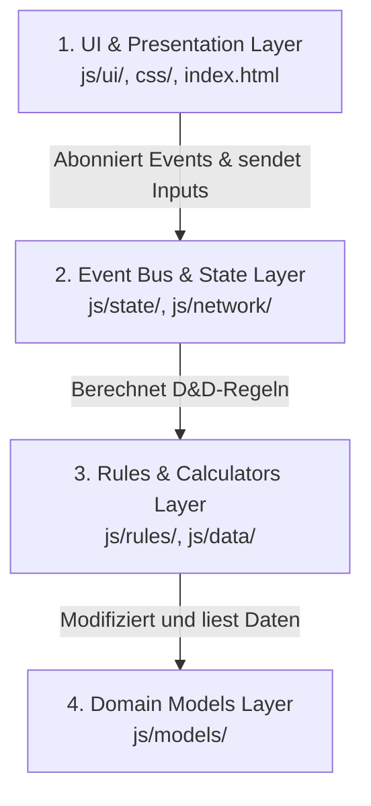

# Übergabeprotokoll / Developer Transition Briefing: D&D 3.5e Combat App — v3.1.5 (Live)

Hallo! Du übernimmst das D&D 3.5e Combat App-Projekt. Der aktuelle Stand ist **v3.1.5 (Live)**. Das Projekt wurde vollständig stabilisiert, modularisiert und für die Tablet-Nutzung optimiert (der alte, fehleranfällige FAB wurde durch ein integriertes, responsives Systemmenü-Dropdown ersetzt).

Bitte lies dieses Dokument aufmerksam durch, um die Architektur, die Dateistruktur und die Verhaltensregeln der Codebasis zu verstehen.

---

## 1. Wichtige Arbeitsregeln

1. **Testlauf vor jedem Turn-Ende:** Führe immer die Testsuite aus, um die Integrität der Anwendung abzusichern:
   ```powershell
   npm test
   ```
2. **LLM-Kontext-Schonung:** Lade niemals die große PDF-Datei `playershandbook_35e.pdf` in deinen Kontext. Nutze stattdessen das lokale Suchskript:
   ```powershell
   node scratch/search_rules.js "Deine Suchabfrage"
   ```
3. **Persistente UI-Entwicklungen:** Achte bei UI-Aktualisierungen darauf, dass der Tastaturfokus und die Cursor-Position durch den `Focus-Schutz` (`DeltaRenderer.applyWithFocusGuard`) nicht verloren gehen.
4. **Lokales WLAN-Hosting:** Beim Starten von `Start_Server.bat` werden alle verfügbaren IPv4-Adressen deines PCs im Netzwerk ermittelt und in der Konsole ausgegeben, um das Tablet schnell zu verbinden. Run as Administrator, um auf der IP lauschen zu können.

---

## 2. Die 4-Schichten-Architektur

Die Anwendung ist in vier logische Schichten unterteilt, um eine saubere Trennung von Präsentation (Frontend) und D&D-Regelwerk/Zustand (Backend) zu gewährleisten:



### Die Schichten im Detail:
1. **Domain Models (`js/models/`)**: Reines, regelunabhängiges OOD. Stat-Kapselung mit Modifikatoren-Stacking (`Stat.js`), Waffendaten (`Weapon.js`) und Charakterdaten (`Combatant.js`).
2. **Rules & Calculators (`js/rules/`) & Data (`js/data/`)**: Reine D&D 3.5e Regeln. Berechnet stufenbasierte Werte und stellt Definitionstabellen bereit.
3. **State & Sync (`js/state/`, `js/network/`)**: Verwaltet das In-Memory-Objekt, sichert die Daten ab und synchronisiert kleine Delta-Diffs über WebRTC.
4. **UI & Views (`js/ui/`, `css/`, `index.html`)**: Rendert Teilbereiche reaktiv auf EventBus-Signale und steuert Dialoge.

---

## 3. Dateistruktur & Modulübersicht (v3.1.5)

### 3.1. Domain Models (`js/models/`)
* [Stat.js](file:///c:/Users/Juls/Desktop/CombatApp/js/models/Stat.js): Kapselt D&D-Attribute (Str, Dex, Con etc.), Rettungswürfe und Kampfwerte. Berechnet stapelbare Modifikatoren und Boni regelkonform.
* [Weapon.js](file:///c:/Users/Juls/Desktop/CombatApp/js/models/Weapon.js): Verwaltet Waffeneigenschaften und liefert Rohdaten (z. B. Bedrohungsbereiche als Objekt statt HTML-Formatierungen).
* [Combatant.js](file:///c:/Users/Juls/Desktop/CombatApp/js/models/Combatant.js): Charaktermodell für Spieler (`type: 'p'`), Gegner (`type: 'e'`) und Begleiter. Zerlegt in logische private Hilfsmethoden (z. B. `_applyFeatModifiers`).

### 3.2. Data Registry (`js/data/`)
* [feats-data.js](file:///c:/Users/Juls/Desktop/CombatApp/js/data/feats-data.js): Datenbasis aller ca. 80 Player's Handbook (PHB) Talente.
* [skills-data.js](file:///c:/Users/Juls/Desktop/CombatApp/js/data/skills-data.js): Definition aller 41 Standard-Fertigkeiten.

### 3.3. State & Sync (`js/state/` & `js/network/`)
* [state.js](file:///c:/Users/Juls/Desktop/CombatApp/js/state.js): Fassaden-Schnittstelle, re-exportiert alle State- und Aktionsmethoden.
* [state-core.js](file:///c:/Users/Juls/Desktop/CombatApp/js/state/state-core.js): Verwaltet den globalen In-Memory-Zustand und kapselt den Pub/Sub Event Bus (`StateEvents`).
* [StorageManager.js](file:///c:/Users/Juls/Desktop/CombatApp/js/state/StorageManager.js): LocalStorage-Hydrierung.
* [PCManager.js](file:///c:/Users/Juls/Desktop/CombatApp/js/state/PCManager.js): Steuert PC-Mutationen, Klassenstufen und Multiklassen-Saves.
* [EncounterManager.js](file:///c:/Users/Juls/Desktop/CombatApp/js/state/EncounterManager.js): DM-Encounter-Aktionen, Initiativlisten-Steuerung.
* [NetworkManager.js](file:///c:/Users/Juls/Desktop/CombatApp/js/network/NetworkManager.js): PeerJS- und WebRTC-Sync.
* [MessageQueue.js](file:///c:/Users/Juls/Desktop/CombatApp/js/network/MessageQueue.js): Debouncing und Pufferung von Sync-Paketen.
* [SyncProtocol.js](file:///c:/Users/Juls/Desktop/CombatApp/js/network/SyncProtocol.js): Errechnet minimale Pfad-basierte Diffs (ca. 50-100 Byte).

### 3.4. Rules & Calculators (`js/rules/`)
* [BABCalculator.js](file:///c:/Users/Juls/Desktop/CombatApp/js/rules/BABCalculator.js) / [SaveCalculator.js](file:///c:/Users/Juls/Desktop/CombatApp/js/rules/SaveCalculator.js) / [SpellSlotCalculator.js](file:///c:/Users/Juls/Desktop/CombatApp/js/rules/SpellSlotCalculator.js): Stufenbasierte Wertermittlung.
* **Klassen-Regeln (`js/rules/classes/`)**: Kapselt klassenspezifische Logik (z. B. `BarbarianRules.js`, `MonkRules.js` für waffenlosen Schaden, `RogueRules.js` für Sneak-Attack-Skalierung, `RangerRules.js` für Erzfeind-Boni).

### 3.5. Presentation & UI (`js/ui/`)
* [ui-core.js](file:///c:/Users/Juls/Desktop/CombatApp/js/ui/ui-core.js): Einstiegspunkt des UI-Renderers.
* **UI-Tabs (`js/ui/components/player/`)**:
  - [PCHeader.js](file:///c:/Users/Juls/Desktop/CombatApp/js/ui/components/player/PCHeader.js) / [PCAttributes.js](file:///c:/Users/Juls/Desktop/CombatApp/js/ui/components/player/PCAttributes.js) / [PCDefenses.js](file:///c:/Users/Juls/Desktop/CombatApp/js/ui/components/player/PCDefenses.js).
  - [PCOffense.js](file:///c:/Users/Juls/Desktop/CombatApp/js/ui/components/player/PCOffense.js) (Waffenkarten, Drawer-Events).
  - [PCResources.js](file:///c:/Users/Juls/Desktop/CombatApp/js/ui/components/player/PCResources.js) (Reiter-Steuerung rechts).
  - [PCSpellbookTab.js](file:///c:/Users/Juls/Desktop/CombatApp/js/ui/components/player/PCSpellbookTab.js) / [PCCompendiumTab.js](file:///c:/Users/Juls/Desktop/CombatApp/js/ui/components/player/PCCompendiumTab.js) / [PCFeatsTab.js](file:///c:/Users/Juls/Desktop/CombatApp/js/ui/components/player/PCFeatsTab.js).
* **Pergament-Dialoge (`js/ui/dialogs/`)**:
  - [dialogs.js](file:///c:/Users/Juls/Desktop/CombatApp/js/ui/components/dialogs.js): Fassaden-Export für alle Dialoge.
  - [BaseDialogs.js](file:///c:/Users/Juls/Desktop/CombatApp/js/ui/dialogs/BaseDialogs.js): System-Alerts, Custom-Prompts.
  - [AttackChoiceDialog.js](file:///c:/Users/Juls/Desktop/CombatApp/js/ui/dialogs/AttackChoiceDialog.js): Wurf-Optionen (Standard vs. Voller Angriff, Smite, Sneak).
  - [PrepareSpellDialog.js](file:///c:/Users/Juls/Desktop/CombatApp/js/ui/dialogs/PrepareSpellDialog.js): Metamagische Slot-Belegung.
  - [SpellScrollDialog.js](file:///c:/Users/Juls/Desktop/CombatApp/js/ui/dialogs/SpellScrollDialog.js) / [FeatScrollDialog.js](file:///c:/Users/Juls/Desktop/CombatApp/js/ui/dialogs/FeatScrollDialog.js): Detail-Rolls für Zauber und Talente.
  - [SessionDialog.js](file:///c:/Users/Juls/Desktop/CombatApp/js/ui/dialogs/SessionDialog.js): Multiplayer-Verbindungen.

---

## 4. Kern-Automatisierungen & D&D-Regeln

* **Physisches Würfeln:** Es gibt **keine** digitale Physik-Engine. Klicks auf `🎲` oder Waffen-Angriffe öffnen Modals mit der exakten Wurf-Formel (z. B. `d20 + 3 (Base) + 2 (Stärke) + 1 (Fokus) = d20 + 6`). Der Spieler würfelt physisch am Tisch und vergleicht das Ergebnis.
* **Saves als Stat-Objekte:** Zähigkeit (`za`), Reflex (`ref`) und Willenskraft (`wil`) sind vollwertige `Stat`-Instanzen (keine simplen Getter). Dadurch können temporäre Modifikatoren (z. B. Buff-Zauber) regelkonform gestapelt werden.
* **Kompensation von UI-Feedback-Loops:** Beim manuellen Editieren von Werten im UI werden aktive Boni (z. B. durch Wut oder Zauber) automatisch von der Eingabe subtrahiert, bevor die neue Basis gespeichert wird, um mathematische Feedback-Schleifen zu verhindern.
* **Metamagie & Templates:** Caster können Slots mit metamagischen Talenten (Extend, Empower, Maximize, Quicken) belegen. Zaubervorlagen (Templates) können benannt, persistiert, geladen und in den "Tagesreset 🌅" integriert werden.
* **Systemmenü-Dropdown (v3.1.5):** Um Darstellungsfehler auf Tablets zu beheben, wurde der alte Floating Action Button (FAB) komplett entfernt. Die Systemaktionen befinden sich nun in einem absolut positionierten Dropdown-Menü `#systemDropdownMenu`, das über den `⚙️ System`-Reiter (Spieler) oder `⚙️ System`-Button (DM) getriggert wird.

---

## 5. Historisches Fehler-Archiv (Behoben in v2.9.0 - v3.1.5)

Folgende Fehler wurden erfolgreich behoben und sollten als Referenz bei zukünftigen Änderungen im Auge behalten werden:

1. **Fokusverlust bei Sucheingabe (Feats/Spells):** Das Ersetzen von `innerHTML` auf dem gesamten Container zerstörte das Input-Feld. Gelöst durch Teillisten-Aktualisierung (`renderCompendiumOnly`), wodurch das Suchfeld im DOM stabil bleibt.
2. **Talent-Voraussetzungsprüfung:** Das Umgehen von Talentbedingungen wurde durch `checkFeatPrerequisites` und Validierungen im UI- und State-Layer vollständig unterbunden.
3. **Klassenwechsel-Lecks (Class Bleed):** Beim Entfernen einer Klasse (z. B. Paladin) blieben Talente wie "Zusätzliches Vertreiben" fälschlicherweise erhalten. Behoben durch eine automatische Bereinigung (`cleanupFeatsDependingOnClass` in `PCManager.js`), die klassenabhängige Zustände restlos tilgt.
4. **Zoom & Klickflächen-Verschiebung (DPI-Bug):** Der Width-Hack `width: calc(100% / var(--app-scale))` führte bei Windows-Skalierung (z. B. 150% DPI) zu Rundungsfehlern bei Browser-Klickflächen. Gelöst durch Umstellung von `transform-origin: top left` auf `top center` und dynamischer Scrollhöhen-Anpassung via `ResizeObserver` und `body.style.minHeight`.
5. **Netzwerk-Duplikate:** Importierte PC-Daten erhielten teils neue IDs, was zu Spieler-Klonen auf dem DM-Bildschirm führte. Gelöst durch "In-Place Updates" (Beibehaltung der aktiven WebRTC-ID) und Synchronisations-Safeguards im Host.
6. **"You Died" Crash:** Ein Absturz beim Fallen unter -10 TP wurde behoben, indem `syncPCToHost` ordnungsgemäß aus `PCManager.js` in das Fassaden-Modul `state.js` exportiert wurde.

---

## 6. Zukünftige Roadmap & Backlog

Folgende Meilensteine stehen als Nächstes an:

### A. Magische Waffen & Ausrüstung (Armory - v3.2+)
* Integration von Schadenseigenschaften (z. B. *Flammend* +1w6 Feuerschaden) und Waffeneffekten (z. B. *Scharf* zur Verdoppelung des Bedrohungsbereichs im UI).
* Dynamische Rüstungs- und Schild-Ausrüstung im UI zur automatischen AC-Neuberechnung.

### B. Zielgerichtete Buffs & Zauber (Targeting-System - v3.3+)
* Ermöglicht das Anwählen von Mitspielern/Gegnern, um Buffs (z. B. *Heldenmut*, *Stärke des Stiers*) oder Zustände direkt per WebRTC zu übertragen und reaktiv auf dem Zielbogen zu berechnen.
