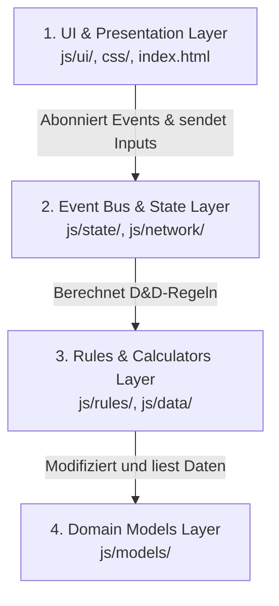

# Übergabeprotokoll / Developer Transition Briefing: D&D 3.5e Combat App — v3.2.5 (Live)

Hallo! Du übernimmst das D&D 3.5e Combat App-Projekt. Der aktuelle Stand ist **v3.2.5 (Live, Branch: `feature/MagicItems`)**.

Bitte lies dieses Dokument aufmerksam durch, um die Architektur, die Dateistruktur und die Verhaltensregeln der Codebasis zu verstehen.

---

## 1. Wichtige Arbeitsregeln

1. **Testlauf vor jedem Turn-Ende:** Führe immer die Testsuite aus, um die Integrität der Anwendung abzusichern:
   ```powershell
   node --import ./Tests/setup.js --test Tests/**/*.test.js
   ```
   (PowerShell blockiert `npm test` durch Ausführungsrichtlinien — direkt `node` nutzen.)
2. **LLM-Kontext-Schonung:** Lade niemals die große PDF-Datei `playershandbook_35e.pdf` in deinen Kontext. Nutze stattdessen das lokale Suchskript:
   ```powershell
   node scratch/search_rules.js "Deine Suchabfrage"
   ```
3. **Persistente UI-Entwicklungen:** Achte bei UI-Aktualisierungen darauf, dass der Tastaturfokus und die Cursor-Position durch den `Focus-Schutz` (`DeltaRenderer.applyWithFocusGuard`) nicht verloren gehen.
4. **Lokales WLAN-Hosting:** Beim Starten von `Start_Server.bat` werden alle verfügbaren IPv4-Adressen deines PCs im Netzwerk ermittelt und in der Konsole ausgegeben, um das Tablet schnell zu verbinden. Run as Administrator, um auf der IP lauschen zu können.
5. **Service Worker Cache-Versionierung:** Das Muster ist `vX.Y.Z-cache-vN`. Beim Hochgehen der Versionsnummer beginnt der Cache-Zähler wieder bei 1. Beim Bugfixing innerhalb einer Version wird nur `N` inkrementiert.
   - Aktuelle Version: `dnd-combatsheet-v3.2.5-cache-v2`
   - Betrifft: `service-worker.js` (Zeile 1, `CACHE_NAME`) und `index.html` (Footer-Version).

---

## 2. Die 4-Schichten-Architektur

Die Anwendung ist in vier logische Schichten unterteilt, um eine saubere Trennung von Präsentation (Frontend) und D&D-Regelwerk/Zustand (Backend) zu gewährleisten:



### Die Schichten im Detail:
1. **Domain Models (`js/models/`)**: Reines, regelunabhängiges OOD. Stat-Kapselung mit Modifikatoren-Stacking (`Stat.js`), Waffendaten (`Weapon.js`), Rüstungsdaten (`Armor.js`), magische Gegenstände (`Item.js`) und Charakterdaten (`Combatant.js`).
2. **Rules & Calculators (`js/rules/`) & Data (`js/data/`)**: Reine D&D 3.5e Regeln. Berechnet stufenbasierte Werte und stellt Definitionstabellen bereit.
3. **State & Sync (`js/state/`, `js/network/`)**: Verwaltet das In-Memory-Objekt, sichert die Daten ab und synchronisiert kleine Delta-Diffs über WebRTC.
4. **UI & Views (`js/ui/`, `css/`, `index.html`)**: Rendert Teilbereiche reaktiv auf EventBus-Signale und steuert Dialoge.

---

## 3. Dateistruktur & Modulübersicht (v3.2.5)

### 3.1. Domain Models (`js/models/`)
* [Stat.js](file:///c:/Users/Juls/Desktop/CombatApp/js/models/Stat.js): Kapselt D&D-Attribute (Str, Dex, Con etc.), Rettungswürfe und Kampfwerte. Berechnet stapelbare Modifikatoren und Boni regelkonform.
* [Weapon.js](file:///c:/Users/Juls/Desktop/CombatApp/js/models/Weapon.js): Verwaltet Waffeneigenschaften. Enthält `WeaponRegistry` mit allen PHB-Waffen, Getter für `grip`/`damageDice`/`crit`/`extraDamage`, Abwärtskompatibilität für alte `extraDamage`-Strings (Parsing in `extraDamageDice` + `extraDamageType`).
* [Armor.js](file:///c:/Users/Juls/Desktop/CombatApp/js/models/Armor.js): Rüstungs- und Schildmodell mit `ARMOR_REGISTRY`, AC-Bonus, Max-DEX-Limit, Rüstungsmalus, Gewichtskategorie.
* [Item.js](file:///c:/Users/Juls/Desktop/CombatApp/js/models/Item.js): Magisches Gegenstandsmodell. Unterstützt mehrere Effekte (`effects[]`-Array). Abwärtskompatibilität via Getter/Setter für Legacy-Felder `effectType`/`effectTarget`/`effectValue`.
* [Combatant.js](file:///c:/Users/Juls/Desktop/CombatApp/js/models/Combatant.js): Charaktermodell für Spieler (`type: 'p'`), Gegner (`type: 'e'`) und Begleiter. Enthält `enterShape()`/`exitShape()` für Druiden-Tiergestalt.

### 3.2. Data Registry (`js/data/`)
* [feats-data.js](file:///c:/Users/Juls/Desktop/CombatApp/js/data/feats-data.js): Datenbasis aller ca. 80 Player's Handbook (PHB) Talente.
* [skills-data.js](file:///c:/Users/Juls/Desktop/CombatApp/js/data/skills-data.js): Definition aller 41 Standard-Fertigkeiten.
* [armor-data.js](file:///c:/Users/Juls/Desktop/CombatApp/js/data/armor-data.js): Alle PHB-Rüstungen und Schilde mit Typwerten.

### 3.3. State & Sync (`js/state/` & `js/network/`)
* [state.js](file:///c:/Users/Juls/Desktop/CombatApp/js/state.js): Fassaden-Schnittstelle, re-exportiert alle State- und Aktionsmethoden (inkl. neuer Item-Effekt-Aktionen).
* [state-core.js](file:///c:/Users/Juls/Desktop/CombatApp/js/state/state-core.js): Verwaltet den globalen In-Memory-Zustand und kapselt den Pub/Sub Event Bus (`StateEvents`).
* [StorageManager.js](file:///c:/Users/Juls/Desktop/CombatApp/js/state/StorageManager.js): LocalStorage-Hydrierung.
* [PCManager.js](file:///c:/Users/Juls/Desktop/CombatApp/js/state/PCManager.js): Steuert PC-Mutationen, Klassenstufen und Multiklassen-Saves. Enthält alle Item- und Waffen-Aktionen inkl.:
  - `addPCItem()`, `deletePCItem()`, `updatePCItem()`, `togglePCItemEquip()`
  - `addPCItemEffect(itemIdx)`, `deletePCItemEffect(itemIdx, effectIdx)`, `updatePCItemEffect(itemIdx, effectIdx, key, val)`
  - `updatePCWeapon(idx, field, val)` (unterstützt neu: `extraDamageDice`, `extraDamageType`)
* [EncounterManager.js](file:///c:/Users/Juls/Desktop/CombatApp/js/state/EncounterManager.js): DM-Encounter-Aktionen, Initiativlisten-Steuerung.
* [NetworkManager.js](file:///c:/Users/Juls/Desktop/CombatApp/js/network/NetworkManager.js): PeerJS- und WebRTC-Sync.
* [MessageQueue.js](file:///c:/Users/Juls/Desktop/CombatApp/js/network/MessageQueue.js): Debouncing und Pufferung von Sync-Paketen.
* [SyncProtocol.js](file:///c:/Users/Juls/Desktop/CombatApp/js/network/SyncProtocol.js): Errechnet minimale Pfad-basierte Diffs (ca. 50-100 Byte).

### 3.4. Rules & Calculators (`js/rules/`)
* [BABCalculator.js](file:///c:/Users/Juls/Desktop/CombatApp/js/rules/BABCalculator.js) / [SaveCalculator.js](file:///c:/Users/Juls/Desktop/CombatApp/js/rules/SaveCalculator.js) / [SpellSlotCalculator.js](file:///c:/Users/Juls/Desktop/CombatApp/js/rules/SpellSlotCalculator.js): Stufenbasierte Wertermittlung.
* [AttackEngine.js](file:///c:/Users/Juls/Desktop/CombatApp/js/rules/AttackEngine.js): Zentraler Angriffs-Sequenzer. Berechnet Angriffs- und Schadenswürfe inkl. `extraDamage` aus Waffen-Getter.
* **Klassen-Regeln (`js/rules/classes/`)**: Kapselt klassenspezifische Logik (z. B. `BarbarianRules.js`, `MonkRules.js` für waffenlosen Schaden, `RogueRules.js` für Sneak-Attack-Skalierung, `RangerRules.js` für Erzfeind-Boni).

### 3.5. Presentation & UI (`js/ui/`)
* [ui-core.js](file:///c:/Users/Juls/Desktop/CombatApp/js/ui/ui-core.js): Einstiegspunkt des UI-Renderers.
* **UI-Tabs (`js/ui/components/player/`):**
  - [PCHeader.js](file:///c:/Users/Juls/Desktop/CombatApp/js/ui/components/player/PCHeader.js) / [PCAttributes.js](file:///c:/Users/Juls/Desktop/CombatApp/js/ui/components/player/PCAttributes.js) / [PCDefenses.js](file:///c:/Users/Juls/Desktop/CombatApp/js/ui/components/player/PCDefenses.js).
  - [PCOffense.js](file:///c:/Users/Juls/Desktop/CombatApp/js/ui/components/player/PCOffense.js): Waffenkarten, Drawer-Events, Waffen- und Rüstungs-Inventar. **Achtung:** Bei Wild Shape (`pc.activeShape !== "none"`) ruft er `_renderNaturalAttacksList()` auf — diese Funktion ist aktuell nicht definiert (⚠ **Bug #16**).
  - [PCMagicItemsTab.js](file:///c:/Users/Juls/Desktop/CombatApp/js/ui/components/player/PCMagicItemsTab.js): Dedizierter Tab für magische Gegenstände. Linke Spalte: Ausgerüstete Slot-Boxen + Slotless-Liste. Rechte Spalte: Rucksack/Inventar mit mehrfachen Effekten pro Gegenstand und Inline-„➕ Effekt"-Button.
  - [PCResources.js](file:///c:/Users/Juls/Desktop/CombatApp/js/ui/components/player/PCResources.js): Reiter-Steuerung rechts.
  - [PCSpellbookTab.js](file:///c:/Users/Juls/Desktop/CombatApp/js/ui/components/player/PCSpellbookTab.js) / [PCCompendiumTab.js](file:///c:/Users/Juls/Desktop/CombatApp/js/ui/components/player/PCCompendiumTab.js) / [PCFeatsTab.js](file:///c:/Users/Juls/Desktop/CombatApp/js/ui/components/player/PCFeatsTab.js).
* **Player Sheet Navigation (`js/ui/components/player-sheet.js`):**
  - Enthält 5 Tabs: Übersicht, Skills & Talente, Ausrüstung, Zauberbuch, Klasse & Begleiter, System.
  - **Achtung:** Der Tab „Ausrüstung" rendert `renderPCOffense()` – dieser crasht im Wild-Shape-Modus (⚠ **Bug #16**).
* **Pergament-Dialoge (`js/ui/dialogs/`)**: Wie in v3.1.5.

---

## 4. Tab-Struktur des Spielerbogens

| Tab | Linke Spalte | Rechte Spalte |
|---|---|---|
| **Übersicht** | Attribute & Saves | AC/Verteidigung & Regeln |
| **Skills & Talente** | Fertigkeiten | Talente-Kompendium |
| **Ausrüstung** | Aktive Slots (Haupthand/Nebenhand/Rüstung) | Rucksack: Waffenliste & Rüstungsliste |
| **Magische Gegenstände** *(NEU v3.2.5)* | Ausgerüstete Slot-Boxen (11 Slots + Slotless) | Rucksack: Magische Gegenstände mit Multi-Effekten |
| **Zauberbuch** | Zauberbuch & Slot-Ressourcen | Kompendium & Vorbereitung |
| **Klasse & Begleiter** | Klassen-Features | Begleiter/Vertrauter |
| **System** | — | System-Dropdown |

---

## 5. Kern-Features & D&D-Regeln

* **Physisches Würfeln:** Es gibt **keine** digitale Physik-Engine. Klicks auf `🎲` oder Waffen-Angriffe öffnen Modals mit der exakten Wurf-Formel. Der Spieler würfelt physisch am Tisch.
* **Saves als Stat-Objekte:** Zähigkeit (`za`), Reflex (`ref`) und Willenskraft (`wil`) sind vollwertige `Stat`-Instanzen.
* **Magische Gegenstände (v3.2.5):** Items unterstützen mehrere Effekte (`effects[]`). Legacy-Items mit `effectType`/`effectTarget`/`effectValue` werden beim Laden automatisch migriert.
* **Zusatzschaden bei Waffen (v3.2.5):** `extraDamageDice` (z. B. `1w6`) und `extraDamageType` (z. B. `Feuer`) ersetzen das alte freie `extraDamage`-Textfeld. Der `extraDamage`-Getter baut den String dynamisch zusammen. Legacy-Strings werden beim Laden geparst.

---

## 6. Bekannte offene Bugs (Stand: 10.06.2026)

Vollständige Liste: [Bugtracking.md](file:///c:/Users/Juls/Desktop/CombatApp/docs/Bugtracking.md)

| # | Titel | Priorität |
|---|---|---|
| **16** ⚠ | **Crash beim Tab „Ausrüstung" in Wild Shape** — `_renderNaturalAttacksList` ist nicht definiert in `PCOffense.js` (Zeile 85). Wahrscheinlich wurde die Funktion bei der Magic-Items-Implementierung nicht mitübertragen. | **KRITISCH** |
| **15** | Druiden-Tiergestalt: Attributswerte/RK/Rettungswürfe werden nicht korrekt berechnet. | Hoch |
| **14** | Endlosschleife beim Verlernen von Talenten (FeatScrollDialog.js). | Mittel |
| **13** | Talent-Auswahl: Fehlende Obergrenze nach PHB. | Mittel |
| **12** | Fertigkeiten: Keine 0 eintragbar. | Niedrig |
| **11** | „Trained Only"-Skills nicht ausgegraut bei 0 Rängen. | Niedrig |
| **10** | Level-Dropdown abgeschnitten (PCAttributes.js). | Niedrig |
| **9** | Waffenslots: Hand-Zuweisung (Main/Off) fehlt im aktiven Slot. | Mittel |
| **8** | Bekannte Zauber-Limit nicht geprüft (Barden/Hexenmeister). | Mittel |
| **7** | Scrollverhalten bei langen Listen (Weapons/Armor Stash). | Niedrig |
| **6** | Barbar: Kampfrausch-Werte nicht korrekt. | Hoch |
| **5** | Schurke: Kein Toggle-Button für Hinterhältigen Angriff im Angriffs-Panel. | Mittel |
| **4** | Fertigkeiten-Obergrenze wird nicht durchgesetzt. | Mittel |
| **3** | Talente-Dropdown breiter als Suchfeld. | Niedrig |
| **2** | Paladin: Handauflegen ignoriert CHA-Modifier. | Mittel |
| **1** | Fehlende Regelerklärungen bei diversen Klassen. | Niedrig |

---

## 7. Historisches Fehler-Archiv (Behoben in v2.9.0 - v3.2.5)

1. **Fokusverlust bei Sucheingabe (Feats/Spells):** Teillisten-Aktualisierung statt vollständigem `innerHTML`-Ersatz.
2. **Talent-Voraussetzungsprüfung:** `checkFeatPrerequisites()` in `feats-data.js`, blockiert `addPCFeat()` bei Verstößen.
3. **Klassenwechsel-Lecks (Class Bleed):** `cleanupFeatsDependingOnClass()` in `PCManager.js`.
4. **Zoom & Klickflächen-Verschiebung (DPI-Bug):** `transform-origin: top center` + `ResizeObserver`.
5. **Netzwerk-Duplikate:** In-Place Updates, Full-Sync bei Import, DM-Safeguards.
6. **„You Died" Crash:** `syncPCToHost` korrekt in `state.js` exportiert.
7. **Drawer-Persistenz-Bugfix (Waffen):** Stabile `Weapon.id`, `openDrawerIds`-Set in `PCOffense.js`.
8. **TWF & Doppelwaffen:** Ranger-Rüstungs-Einschränkung, Hand-Dropdowns, Warn-Popups, Kampfstab-Wahl-Dialog.

---

## 8. Zukünftige Roadmap & Backlog

### ⚠️ Sofort (Hotfix vor nächstem Feature)
* **Bug #16 beheben:** `_renderNaturalAttacksList` in `PCOffense.js` fehlt → Crash beim Tab-Wechsel zu „Ausrüstung" im Wild-Shape-Modus.

### 🔮 v3.3 — Buff- & Auren-Manager (Targeting-System)
* **Persönliche Buffs:** Schnellwahl-Panel für eigene Effekte (z. B. *Magierrüstung* [+4 RK], *Stärke des Stiers* [+4 STR]).
* **Netzwerk-Auren (WebRTC):** Buffs (wie *Bardenmusik* oder Paladin-Auren) an verbündete Ziele senden.

### 🏰 v3.4 — DM-UI Komplett-Refactoring & Redesign
* Modularisierung der `dm-screen.js`, Modernisierung des Initiative-Monitors, Tierbegleiter als eigenständige Kampfteilnehmer.

### 🪙 v3.5 — Loot-Generator & Universeller Ressourcen-Tracker
* Loot-Generator für DM (Gold, Edelsteine, Tränke nach EL-Tabellen), Custom Ressourcen-Tracker für Spieler.

### 🐉 v3.6 — Monster-Kompendium (SRD JSON-Integration)
* SRD-JSON-Datenbank aller D&D 3.5e Kreaturen, Ein-Klick-Begegnungsaufbau im DM-Screen.

### v3.7 — Beispieldatengenerator
* PC-, NPC- und Monster-Generator mit Klassen-, Völker- und Rollenauswahl aus dem SRD.