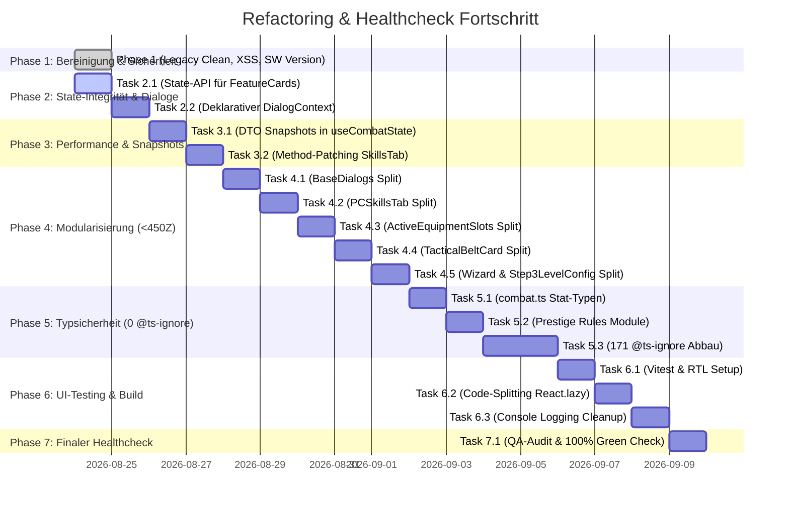

# Refactoring Progress Log & Agent Handover Journal

> **Projekt:** TheCombatant (v6.0.0 / v5.1)  
> **Branch:** `refactoring/v5.1`  
> **Masterplan:** [`docs/refactoring_masterplan_v6.md`](file:///c:/Users/styles/PRIVATE/TheCombatant/TheCombatant/docs/refactoring_masterplan_v6.md)  
> **Audit-Referenz:** [`docs/deep_code_audit_analysis.md`](file:///c:/Users/styles/PRIVATE/TheCombatant/TheCombatant/docs/deep_code_audit_analysis.md)  
> **Letztes Update:** 24. August 2026

Dieses Dokument dient als **zentrales, feingranulares Übergabe- und Fortschrittsjournal** für alle Entwickler, Maschinen und AI-Agenten. Jeder Schritt wird mit exakten Datei-Referenzen, Commit-Hashes und Test-Ergebnissen dokumentiert.

---

## 📊 Gesamt-Fortschrittsübersicht



| Phase | Fokus | Status | Commits | Tests | Typecheck |
| :--- | :--- | :---: | :---: | :---: | :---: |
| **Phase 1** | Bereinigung toter Dateien, XSS-Schutz, SW-Version | ✅ **Abgeschlossen** | `e613713`, `92d6f00` | 304 / 304 ✅ | 0 Fehler ✅ |
| **Phase 2** | State-API-Compliance, Declarative DialogContext | ⏳ **In Vorbereitung** | — | — | — |
| **Phase 3** | Snapshot DTOs, V8-Deopt Beseitigung, SkillsTab Patch | ⏳ Ausstehend | — | — | — |
| **Phase 4** | Modularisierung aller 13 Dateien > 600 Zeilen | ⏳ Ausstehend | — | — | — |
| **Phase 5** | Vollständige Typsicherheit, Abbau aller 171 `@ts-ignore` | ⏳ Ausstehend | — | — | — |
| **Phase 6** | Vitest UI-Tests, `React.lazy()` Code-Splitting | ⏳ Ausstehend | — | — | — |
| **Phase 7** | Finaler Healthcheck-Scan (0 Gelb / 0 Rot) | ⏳ Ausstehend | — | — | — |

---

## 📝 Detailliertes Phasen-Journal

### ✅ Phase 1: Sofortige Bereinigung & Sicherheit
- **Datum:** 24. August 2026
- **Commit:** `e613713` (*"refactor(phase-1): clean legacy dead code, add HTML sanitization against XSS, and sync SW version to package.json"*)

#### Durchgeführte Änderungen:
1. **Toter Legacy-Code:**
   - `[DELETE]` `js/app.js` (705 Zeilen — alter Vanilla-App-Code)
   - `[DELETE]` `js/ui/ui-core.js` (106 Zeilen — fehlerhafter Alt-Import)
2. **XSS-Sanitization:**
   - `[NEW]` [`src/utils/sanitize.ts`](file:///c:/Users/styles/PRIVATE/TheCombatant/TheCombatant/src/utils/sanitize.ts) erstellt (Zero-Dependency HTML Sanitizer mit Tag-Whitelist).
   - `[MODIFY]` [`src/components/dialogs/BaseDialogs.tsx`](file:///c:/Users/styles/PRIVATE/TheCombatant/TheCombatant/src/components/dialogs/BaseDialogs.tsx) (`CustomAlertModal` & `CustomConfirmModal` mit `sanitizeHtml` abgesichert).
   - `[MODIFY]` [`src/components/player/features/PrestigeClassFeaturesCard.tsx`](file:///c:/Users/styles/PRIVATE/TheCombatant/TheCombatant/src/components/player/features/PrestigeClassFeaturesCard.tsx) (`ui.rawText` mit `sanitizeHtml` abgesichert).
3. **Service Worker Versionierung:**
   - `[MODIFY]` [`scratch/update_sw.js`](file:///c:/Users/styles/PRIVATE/TheCombatant/TheCombatant/scratch/update_sw.js) liest Version nun dynamisch aus `package.json` ➔ Generiert `dnd-combatsheet-v6.0.0-cache-v1`.
4. **CI/CD Pipeline:**
   - `[MODIFY]` [`.github/workflows/deploy.yml`](file:///c:/Users/styles/PRIVATE/TheCombatant/TheCombatant/.github/workflows/deploy.yml) & [`.github/workflows/ci.yml`](file:///c:/Users/styles/PRIVATE/TheCombatant/TheCombatant/.github/workflows/ci.yml) für Secret-Übergabe angepasst.

#### Verifikation & Testergebnisse:
- `npm run typecheck` ➔ **0 Fehler**
- `npm run test` ➔ **304 / 304 Tests bestanden** (24 Suiten, 0 Fehler, 11.6s)
- `npm run build` ➔ **Erfolgreich gebündelt**

---

### ⏳ Phase 2: State-Integrität & DialogContext (Nächster Schritt)

#### Geplante Unter-Tasks:

```
[ ] Task 2.1: State-API für Feature-Karten (js/state/pc/)
    [ ] 2.1.1: Neue State-Funktion in PCClasses.js: updatePCWizardSpecialization(spec, prob1, prob2)
    [ ] 2.1.2: Neue State-Funktion in PCClasses.js: togglePCSneakAttack(isActive)
    [ ] 2.1.3: Neue State-Funktion in PCClasses.js: togglePCTrickyFighting(isActive)
    [ ] 2.1.4: Neue State-Funktion in PCGeneral.js: updatePCDailyAbilityUsed(abilityIndex, delta)
    [ ] 2.1.5: Refactoring WizardFeaturesCard.tsx (getActivePC-Mutationen entfernen)
    [ ] 2.1.6: Refactoring PrestigeClassFeaturesCard.tsx (getActivePC-Mutationen entfernen)
    [ ] 2.1.7: Refactoring CompanionSheet.tsx & FamiliarSheet.tsx (getActivePC-Mutationen entfernen)
    [ ] 2.1.8: Verifikation: npm run test & npm run typecheck

[ ] Task 2.2: Deklarativer DialogContext (Ablösung der Window-Bridge)
    [ ] 2.2.1: src/context/DialogContext.tsx erstellen
    [ ] 2.2.2: DialogProvider in src/main.tsx einbinden
    [ ] 2.2.3: Dialoge deklarativ im React-Tree steuern (useDialog Hook)
    [ ] 2.2.4: ReactDialogBridge.tsx und window.__REACT_DIALOG_BRIDGE__ entfernen
    [ ] 2.2.5: Verifikation: npm run test & npm run typecheck
```

---

### ⏳ Phase 3: Performance & Snapshot-Entkopplung

#### Geplante Unter-Tasks:
```
[ ] Task 3.1: useCombatState.ts Verschlankung
    [ ] 3.1.1: Object.setPrototypeOf Aufrufe entfernen (Snapshots als reine Read-Only DTOs)
    [ ] 3.1.2: Doppelte JSON.parse(JSON.stringify) Klonungen auf einen Durchlauf reduzieren
    [ ] 3.1.3: Verifikation: Profiling & npm run test

[ ] Task 3.2: PCSkillsTab.tsx Method-Patching eliminieren
    [ ] 3.2.1: getSkillRanks, getSkillMisc, getArmorCheckPenalty durch Pure Utility-Funktionen ersetzen
    [ ] 3.2.2: useMemo patchedPC Workaround restlos entfernen
    [ ] 3.2.3: Verifikation: npm run test & npm run typecheck
```

---

### ⏳ Phase 4: Modularisierung aller 13 Dateien > 600 Zeilen

#### Geplante Unter-Tasks:
```
[ ] Task 4.1: BaseDialogs.tsx (782 Z.) ➔ src/components/dialogs/modals/
    [ ] 4.1.1: CustomAlertModal.tsx
    [ ] 4.1.2: CustomConfirmModal.tsx
    [ ] 4.1.3: CustomPromptModal.tsx
    [ ] 4.1.4: HealingRollModal.tsx
    [ ] 4.1.5: ItemDamageModal.tsx
    [ ] 4.1.6: NewDayTemplateDialog.tsx
    [ ] 4.1.7: RollBreakdownDialog.tsx
    [ ] 4.1.8: SampleChoiceDialog.tsx
    [ ] 4.1.9: BaseDialogs.tsx als schlanke Re-Export Fassade (<100 Z.)

[ ] Task 4.2: PCSkillsTab.tsx (816 Z.) ➔ src/components/player/skills/
    [ ] 4.2.1: PCSkillsTab.tsx (~220 Z. Orchestrierung)
    [ ] 4.2.2: SkillRow.tsx (~180 Z. Zeilenkomponente)
    [ ] 4.2.3: SkillFilterBar.tsx (~100 Z. Suche & Filter)
    [ ] 4.2.4: SkillTricksSubPanel.tsx (~200 Z. Tricks)

[ ] Task 4.3: ActiveEquipmentSlots.tsx (785 Z.) ➔ src/components/player/offense/slots/
    [ ] 4.3.1: ActiveEquipmentSlots.tsx (~200 Z.)
    [ ] 4.3.2: WeaponSlotRenderer.tsx (~220 Z.)
    [ ] 4.3.3: ArmorSlotRenderer.tsx (~180 Z.)
    [ ] 4.3.4: NaturalAttacksRenderer.tsx (~180 Z.)

[ ] Task 4.4: TacticalBeltCard.tsx (772 Z.) ➔ src/components/player/offense/belt/
    [ ] 4.4.1: TacticalBeltCard.tsx (~180 Z.)
    [ ] 4.4.2: PotionBeltSection.tsx (~190 Z.)
    [ ] 4.4.3: ScrollBeltSection.tsx (~190 Z.)
    [ ] 4.4.4: WandBeltSection.tsx (~190 Z.)

[ ] Task 4.5: CharacterWizardDialog.tsx (794 Z.) & Step3LevelConfig.tsx (746 Z.)
    [ ] 4.5.1: WizardSummaryFooter.tsx & WizardQuickRoster.tsx
    [ ] 4.5.2: ClassLevelPicker.tsx & PrestigeRequirementCheck.tsx
```

---

### ⏳ Phase 5: Vollständige Typsicherheit (0 `@ts-ignore`)

#### Geplante Unter-Tasks:
```
[ ] Task 5.1: src/types/combat.ts Typen-Präzisierung
    [ ] 5.1.1: StatField Union Types (StatBlock | number) für za, ref, wil, acTouch, acFlat, sr etc.
    [ ] 5.1.2: Component Props strict typisieren (pc: Combatant)

[ ] Task 5.2: Prestige Rules Module (js/rules/classes/)
    [ ] 5.2.1: AssassinRules.js
    [ ] 5.2.2: ArcaneTricksterRules.js
    [ ] 5.2.3: ShadowbaneInquisitorRules.js
    [ ] 5.2.4: BattleTricksterRules.js
    [ ] 5.2.5: SpellwarpSniperRules.js
    [ ] 5.2.6: EldritchKnightRules.js

[ ] Task 5.3: Systematischer Abbau aller 171 @ts-ignore
    [ ] 5.3.1: PCBuffsTab.tsx & PCSkillsTab.tsx bereinigen
    [ ] 5.3.2: ArmoryTab.tsx & ActiveEquipmentSlots.tsx bereinigen
    [ ] 5.3.3: DMCombatantsTable.tsx & Feature-Cards bereinigen
    [ ] 5.3.4: Pfadaliase auf @core/ vereinheitlichen
```

---

### ⏳ Phase 6: UI-Testing & Build-Optimierung

#### Geplante Unter-Tasks:
```
[ ] Task 6.1: Vitest & React Testing Library
    [ ] 6.1.1: vitest, @testing-library/react, jsdom installieren und konfigurieren
    [ ] 6.1.2: PlayerSheet.test.tsx
    [ ] 6.1.3: CharacterWizard.test.tsx
    [ ] 6.1.4: Modals.test.tsx
    [ ] 6.1.5: npm run test:ui Script definieren

[ ] Task 6.2: Code-Splitting via React.lazy()
    [ ] 6.2.1: Lazy-Loading für CharacterWizardDialog, DMScreen, CampaignManagerDialog
    [ ] 6.2.2: Bundle-Analyse: main.js < 280 kB

[ ] Task 6.3: Console Logging Cleanup
    [ ] 6.3.1: 47 console.log/warn Statements in src/ bereinigen
```

---

### ⏳ Phase 7: Finaler Healthcheck & QA-Abnahme

```
[ ] Task 7.1: Vollständige 100% Green Verification
    [ ] 7.1.1: npm run typecheck (0 Fehler, 0 @ts-ignore)
    [ ] 7.1.2: npm run test (304/304 Tests)
    [ ] 7.1.3: npm run test:ui (100% UI Tests)
    [ ] 7.1.4: npm run build (Sauberes Bundle)
    [ ] 7.1.5: Healthcheck Scan (0 Gelb, 0 Rot)
```

---

## 🛠️ Arbeitsanweisung für nachfolgende Agenten:
1. **Lies vor jeder Änderung:** [`AGENT.md`](file:///c:/Users/styles/PRIVATE/TheCombatant/TheCombatant/AGENT.md) und dieses Dokument.
2. **Arbeite strikt phasen- und task-basiert:** Schließe einen Unter-Task vollständig ab, teste lokal (`npm run test`, `npm run typecheck`), aktualisiere die Checkboxen `[x]` in diesem Dokument und committe atomar.
3. **Keine Breaking Changes:** Die 304 Kern-Tests müssen zu jedem Zeitpunkt grün bleiben.
