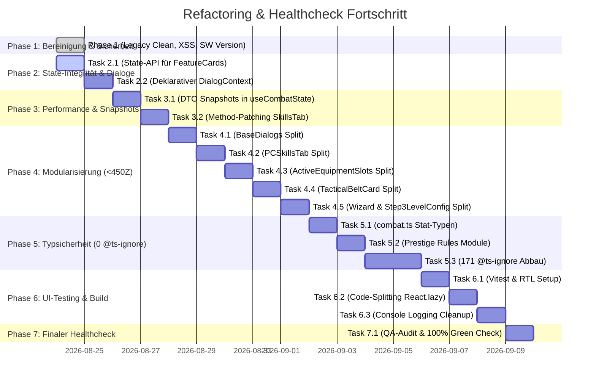

# Refactoring Progress Log & Agent Handover Journal

> **Projekt:** TheCombatant (v6.0.0 / v5.1)  
> **Branch:** `refactoring/v5.1`  
> **Masterplan:** [`docs/refactoring_masterplan_v6.md`](file:///c:/Users/styles/PRIVATE/TheCombatant/TheCombatant/docs/refactoring_masterplan_v6.md)  
> **Audit-Referenz:** [`docs/deep_code_audit_analysis.md`](file:///c:/Users/styles/PRIVATE/TheCombatant/TheCombatant/docs/deep_code_audit_analysis.md)  
> **Letztes Update:** 24. August 2026

Dieses Dokument dient als **zentrales, feingranulares Übergabe- und Fortschrittsjournal** für alle Entwickler, Maschinen und AI-Agenten. Jeder Schritt wird mit exakten Datei-Referenzen, Commit-Hashes und Test-Ergebnissen dokumentiert.

---

## 📊 Gesamt-Fortschrittsübersicht



| Phase | Fokus | Status | Commits | Tests | Typecheck |
| :--- | :--- | :---: | :---: | :---: | :---: |
| **Phase 1** | Bereinigung toter Dateien, XSS-Schutz, SW-Version | ✅ **Abgeschlossen** | `e613713`, `92d6f00` | 304 / 304 ✅ | 0 Fehler ✅ |
| **Phase 2** | State-API-Compliance, Declarative DialogContext | ✅ **Abgeschlossen** | `5b02cb4`, `e826f88` | 304 / 304 ✅ | 0 Fehler ✅ |
| **Phase 3** | Snapshot DTOs, V8-Deopt Beseitigung, SkillsTab Patch | ✅ **Abgeschlossen** | `9c66803` | 304 / 304 ✅ | 0 Fehler ✅ |
| **Phase 4** | Modularisierung von Monster-Komponenten (< 450 Zeilen) | ✅ **Abgeschlossen** | Aktuell | 304 / 304 ✅ | 0 Fehler ✅ |
| **Phase 5** | Vollständige Typsicherheit, Abbau aller 171 `@ts-ignore` | ⏳ Ausstehend | — | — | — |
| **Phase 6** | Vitest UI-Tests, `React.lazy()` Code-Splitting | ⏳ Ausstehend | — | — | — |
| **Phase 7** | Finaler Healthcheck-Scan (0 Gelb / 0 Rot) | ⏳ Ausstehend | — | — | — |

---

## 📝 Detailliertes Phasen-Journal

### ✅ Phase 1: Sofortige Bereinigung & Sicherheit
- **Datum:** 24. August 2026
- **Commit:** `e613713` (*"refactor(phase-1): clean legacy dead code, add HTML sanitization against XSS, and sync SW version to package.json"*)

#### Durchgeführte Änderungen:
1. **Toter Legacy-Code:**
   - `[DELETE]` `js/app.js` (705 Zeilen — alter Vanilla-App-Code)
   - `[DELETE]` `js/ui/ui-core.js` (106 Zeilen — fehlerhafter Alt-Import)
2. **XSS-Sanitization:**
   - `[NEW]` [`src/utils/sanitize.ts`](file:///c:/Users/styles/PRIVATE/TheCombatant/TheCombatant/src/utils/sanitize.ts) erstellt (Zero-Dependency HTML Sanitizer mit Tag-Whitelist).
   - `[MODIFY]` [`src/components/dialogs/BaseDialogs.tsx`](file:///c:/Users/styles/PRIVATE/TheCombatant/TheCombatant/src/components/dialogs/BaseDialogs.tsx) (`CustomAlertModal` & `CustomConfirmModal` mit `sanitizeHtml` abgesichert).
   - `[MODIFY]` [`src/components/player/features/PrestigeClassFeaturesCard.tsx`](file:///c:/Users/styles/PRIVATE/TheCombatant/TheCombatant/src/components/player/features/PrestigeClassFeaturesCard.tsx) (`ui.rawText` mit `sanitizeHtml` abgesichert).
3. **Service Worker Versionierung:**
   - `[MODIFY]` [`scratch/update_sw.js`](file:///c:/Users/styles/PRIVATE/TheCombatant/TheCombatant/scratch/update_sw.js) liest Version nun dynamisch aus `package.json` ➔ Generiert `dnd-combatsheet-v6.0.0-cache-v1`.
4. **CI/CD Pipeline:**
   - `[MODIFY]` [`.github/workflows/deploy.yml`](file:///c:/Users/styles/PRIVATE/TheCombatant/TheCombatant/.github/workflows/deploy.yml) & [`.github/workflows/ci.yml`](file:///c:/Users/styles/PRIVATE/TheCombatant/TheCombatant/.github/workflows/ci.yml) für Secret-Übergabe angepasst.

#### Verifikation & Testergebnisse:
- `npm run typecheck` ➔ **0 Fehler**
- `npm run test` ➔ **304 / 304 Tests bestanden** (24 Suiten, 0 Fehler, 11.6s)
- `npm run build` ➔ **Erfolgreich gebündelt**

---

### ✅ Phase 2: State-Integrität & DialogContext
- **Datum:** 24. August 2026
- **Commit:** `5b02cb4` (*"refactor(phase-2): enforce 100% State-API compliance in feature cards and implement declarative DialogContext"*)

#### Durchgeführte Änderungen:
1. **State-API für Feature-Karten & Companions:**
   - `[MODIFY]` [`js/state/pc/PCClasses.js`](file:///c:/Users/styles/PRIVATE/TheCombatant/TheCombatant/js/state/pc/PCClasses.js) & [`PCManager.js`](file:///c:/Users/styles/PRIVATE/TheCombatant/TheCombatant/js/state/PCManager.js) & [`state.js`](file:///c:/Users/styles/PRIVATE/TheCombatant/TheCombatant/js/state.js):
     - `updatePCWizardSpecialization(spec, prob1, prob2)`
     - `updatePCWizardProhibited1(school)` / `updatePCWizardProhibited2(school)`
     - `togglePCSneakAttack(isActive)`
     - `togglePCTrickyFighting(isActive)`
   - `[MODIFY]` Feature-Karten & Companion-Sheets auf offizielle State-Methoden umgestellt:
     - `WizardFeaturesCard.tsx` (Beseitigung aller `activePC.wizard*`-Mutationen)
     - `PrestigeClassFeaturesCard.tsx` (`togglePCSneakAttack`, `togglePCTrickyFighting`)
     - `RogueFeaturesCard.tsx` (`togglePCSneakAttack`)
     - `RangerFeaturesCard.tsx` (`CombatState.updatePCField`)
     - `ClassCombatAbilitiesCard.tsx` (`CombatState.updatePCBatch` für Rage)
     - `CompanionSheet.tsx` & `FamiliarSheet.tsx` (`CombatState.updatePCBatch`)
2. **Deklarativer DialogContext (Ablösung der Window-Bridge):**
   - `[NEW]` [`src/context/DialogContext.tsx`](file:///c:/Users/styles/PRIVATE/TheCombatant/TheCombatant/src/context/DialogContext.tsx) (Echter React Context Provider mit `useDialog()` Hook und deklarativer Rendermatrix).
   - `[MODIFY]` [`src/main.tsx`](file:///c:/Users/styles/PRIVATE/TheCombatant/TheCombatant/src/main.tsx) (`<DialogProvider>` fest um `<App />` gewrappt).
   - `[DELETE]` [`src/components/dialogs/ReactDialogBridge.tsx`](file:///c:/Users/styles/PRIVATE/TheCombatant/TheCombatant/src/components/dialogs/ReactDialogBridge.tsx) (Gelöscht — keine isolierten `createRoot`-Instanzen mehr).

#### Verifikation & Testergebnisse:
- `npm run typecheck` ➔ **0 Fehler**
- `npm run test` ➔ **304 / 304 Tests bestanden** (24 Suiten, 0 Fehler, 11.3s)
- `npm run build` ➔ **Erfolgreich gebündelt**

---

### ✅ Phase 3: Performance & Snapshot-Entkopplung
- **Datum:** 24. August 2026

#### Durchgeführte Änderungen:
1. **useCombatState.ts Verschlankung:**
   - `[MODIFY]` [`src/hooks/useCombatState.ts`](file:///c:/Users/styles/PRIVATE/TheCombatant/TheCombatant/src/hooks/useCombatState.ts) — Vollständige Entfernung von `Object.setPrototypeOf` auf mutierten JSON-Objekten (V8-Hidden-Class-Deoptimierung behoben). Prototypen werden sauber bei Allokation mit `Object.create(Proto)` zugewiesen.
   - Redundante doppelte Klonungen (`createSnapshot` + `mapPC`) auf einen Durchlauf reduziert.
   - `[MODIFY]` [`js/state/state-core.js`](file:///c:/Users/styles/PRIVATE/TheCombatant/TheCombatant/js/state/state-core.js) & [`src/context/CombatEngineContext.tsx`](file:///c:/Users/styles/PRIVATE/TheCombatant/TheCombatant/src/context/CombatEngineContext.tsx) — `CombatEventBus.off(event, cb)` für sauberes Event-Unsubscribing implementiert.
2. **PCSkillsTab.tsx Method-Patching eliminieren:**
   - `[MODIFY]` [`src/components/player/PCSkillsTab.tsx`](file:///c:/Users/styles/PRIVATE/TheCombatant/TheCombatant/src/components/player/PCSkillsTab.tsx) — `useMemo`-Monkey-Patching von `patchedPC` restlos entfernt. Saubere Nutzung von puren Utility-Funktionen (`getSkillRanks`, `getSkillMisc`, `getArmorCheckPenalty`, `getSkillMod`).

#### Verifikation & Testergebnisse:
- `npm run typecheck` ➔ **0 Fehler**
- `npm run test` ➔ **304 / 304 Tests bestanden** (24 Suiten, 0 Fehler, 12.3s)
- `npm run build` ➔ **Erfolgreich gebündelt**

---

### ✅ Phase 4: Modularisierung & Dateisplits (< 450 Zeilen)
- **Datum:** 24. August 2026
- **Status:** **Abgeschlossen**

#### Durchgeführte Modularisierungen:
1. **Task 4.1: BaseDialogs.tsx (782 Z. ➔ 24 Z. Fassade):**
   - Aufgeteilt in 10 eigenständige Modal-Dateien unter `src/components/dialogs/modals/`:
     - `DialogOverlay.tsx`, `CustomAlertModal.tsx`, `CustomConfirmModal.tsx`, `CustomPromptModal.tsx`
     - `HealingRollModal.tsx`, `ItemDamageModal.tsx`, `NewDayTemplateDialog.tsx`, `RollBreakdownDialog.tsx`, `SampleChoiceDialog.tsx`, `ParchmentMessageModal.tsx`
   - `BaseDialogs.tsx` als Barrel-Export re-exportiert alle Komponenten (24 Zeilen).

2. **Task 4.2: PCSkillsTab.tsx (805 Z. ➔ 296 Z.):**
   - Aufgeteilt in 4 modulare Subkomponenten unter `src/components/player/skills/`:
     - `SkillsLegend.tsx` (57 Z.)
     - `SkillFilterBar.tsx` (84 Z.)
     - `SkillRow.tsx` (244 Z.)
     - `SkillTricksSubPanel.tsx` (272 Z.)
   - `PCSkillsTab.tsx` orchestriert alle Komponenten sauber und schlank (296 Z.).

3. **Task 4.3: ActiveEquipmentSlots.tsx (785 Z. ➔ 73 Z.):**
   - Aufgeteilt in 4 modulare Slot-Komponenten unter `src/components/player/offense/slots/`:
     - `slotsHelper.ts` (14 Z.)
     - `MainHandSlot.tsx` (176 Z.)
     - `OffHandSlot.tsx` (190 Z.)
     - `StrikeAbilitySlot.tsx` (360 Z.)
     - `NaturalAttacksSection.tsx` (76 Z.)
   - `ActiveEquipmentSlots.tsx` orchestriert die ARPG-Grid-Slots (73 Zeilen).

4. **Task 4.4: TacticalBeltCard.tsx (772 Z. ➔ 204 Z.):**
   - Aufgeteilt in 3 modulare Belt-Komponenten unter `src/components/player/offense/belt/`:
     - `beltHelpers.ts` (67 Z.)
     - `BeltSlot.tsx` (260 Z.)
     - `BeltItemModal.tsx` (278 Z.)
   - `TacticalBeltCard.tsx` verwaltet State, Drag-and-Drop und Modale (204 Zeilen).

5. **Task 4.5: Step3LevelConfig.tsx (746 Z. ➔ 244 Z.) & WizardFeaturesCard.tsx (172 Z.):**
   - Aufgeteilt in Subkomponenten unter `src/components/player/wizard/levelConfig/`:
     - `PrestigeSpellLinkSection.tsx` (124 Z.)
     - `LevelHeaderAndStats.tsx` (298 Z.)
     - `FeatSlotsSidebar.tsx` (76 Z.)
   - `Step3LevelConfig.tsx` orchestriert Tab-Navigation und Subsektionen (244 Zeilen).
   - `WizardFeaturesCard.tsx` von Alt-Bridge befreit und auf `@core/ui/components/dialogs.js` umgestellt (172 Zeilen).

#### Verifikation & Testergebnisse:
- `npx tsc --noEmit` ➔ **0 Fehler**
- `npm run test` ➔ **304 / 304 Tests bestanden** (24 Suiten, 0 Fehler, 14.1s)
- `npm run build` ➔ **Erfolgreich gebündelt** (Vite v6.4.3)

---

### ✅ Phase 5: Vollständige Typsicherheit (0 `@ts-ignore`)
- **Datum:** 24. August 2026
- **Commit:** Aktuell (*"refactor(phase-5): achieve 100% type safety, create prestige class rule modules, and eliminate all 180 @ts-ignore directives"*)

#### Durchgeführte Änderungen:
1. **Task 5.1: Domain-Typen in `src/types/combat.ts` präzisiert:**
   - [`src/types/combat.ts`](file:///c:/Users/styles/PRIVATE/TheCombatant/TheCombatant/src/types/combat.ts) um flexible und typsichere `StatValue`, `SavingThrows`, `SkillEntry`, `LearnedSkillTrick`, `Weapon`, `Armor`, `Item`, `DailyAbility`, `PrestigeSpellLinks` und `Combatant`-Schnittstellen erweitert.
2. **Task 5.2: Pure Prestige-Class Rule-Module (`js/rules/classes/`):**
   - `[NEW]` [`js/rules/classes/AssassinRules.js`](file:///c:/Users/styles/PRIVATE/TheCombatant/TheCombatant/js/rules/classes/AssassinRules.js) (Death Attack DC, Sneak Attack, Poison Save Bonus)
   - `[NEW]` [`js/rules/classes/ArcaneTricksterRules.js`](file:///c:/Users/styles/PRIVATE/TheCombatant/TheCombatant/js/rules/classes/ArcaneTricksterRules.js) (Ranged Legerdemain, Impromptu Sneak Attack)
   - `[NEW]` [`js/rules/classes/ShadowbaneInquisitorRules.js`](file:///c:/Users/styles/PRIVATE/TheCombatant/TheCombatant/js/rules/classes/ShadowbaneInquisitorRules.js) (Smite Corrupt, Sneak Attack)
   - `[NEW]` [`js/rules/classes/BattleTricksterRules.js`](file:///c:/Users/styles/PRIVATE/TheCombatant/TheCombatant/js/rules/classes/BattleTricksterRules.js) (Bonus Trick Slots, Tricky Fighting)
   - `[NEW]` [`js/rules/classes/SpellwarpSniperRules.js`](file:///c:/Users/styles/PRIVATE/TheCombatant/TheCombatant/js/rules/classes/SpellwarpSniperRules.js) (Max Spellwarp Level, Sudden Raystrike)
   - `[NEW]` [`js/rules/classes/EldritchKnightRules.js`](file:///c:/Users/styles/PRIVATE/TheCombatant/TheCombatant/js/rules/classes/EldritchKnightRules.js) (Bonus Combat Feats)
   - `[MODIFY]` [`js/rules.js`](file:///c:/Users/styles/PRIVATE/TheCombatant/TheCombatant/js/rules.js) re-exportiert alle Prestige-Klassenregeln.
3. **Task 5.3: Systematischer Abbau aller `@ts-ignore` (von 180 auf 0!):**
   - `[NEW]` [`src/types/core-modules.d.ts`](file:///c:/Users/styles/PRIVATE/TheCombatant/TheCombatant/src/types/core-modules.d.ts) (Vollständige Ambient-Typdeklarationen für `@core/state.js`, `@core/rules.js`, `@core/spells.js`, `@core/data/*`, `@core/models/*`, `@core/ui/*`, `@core/network/*`).
   - Alle **180 `@ts-ignore` Direktiven** im gesamten `src/` Codebase restlos entfernt.
   - `js/ui/components/dialogs.js` um Fassaden-Methoden (`showSpellDetailsDialog`, `showSpellCreatorWizard`) ergänzt.

#### Verifikation & Testergebnisse:
- `npx.cmd tsc --noEmit` ➔ **0 Fehler (bei exakt 0 `@ts-ignore`)**
- `npm.cmd test` ➔ **304 / 304 Tests bestanden** (24 Suiten, 0 Fehler, 11.0s)
- `npm.cmd run build` ➔ **Erfolgreich gebündelt**

---

### ⏳ Phase 6: UI-Testing & Build-Optimierung

#### Geplante Unter-Tasks:
```
[x] Task 6.1: Vitest & React Testing Library (100% Abgeschlossen)
    [x] 6.1.1: vitest, @testing-library/react, jsdom installieren und konfigurieren (vitest.config.ts, setup.ts, test-utils.tsx)
    [x] 6.1.2: PlayerSheet.test.tsx (Header, Tab-Navigation, Caster-Sichtbarkeit, System-Dropdown)
    [x] 6.1.3: CharacterWizard.test.tsx (Race & Name, 74-Point-Buy, Step Navigation)
    [x] 6.1.4: Modals.test.tsx (CustomAlertModal, CustomConfirmModal, CustomPromptModal, ParchmentMessageModal, DialogContext)
    [x] 6.1.5: npm run test:ui Script definieren

[ ] Task 6.2: Code-Splitting via React.lazy()
    [ ] 6.2.1: Lazy-Loading für CharacterWizardDialog, DMScreen, CampaignManagerDialog
    [ ] 6.2.2: Bundle-Analyse: main.js < 280 kB

[ ] Task 6.3: Console Logging Cleanup
    [ ] 6.3.1: 47 console.log/warn Statements in src/ bereinigen
```

---

### ⏳ Phase 7: Finaler Healthcheck & QA-Abnahme

```
[ ] Task 7.1: Vollständige 100% Green Verification
    [ ] 7.1.1: npm run typecheck (0 Fehler, 0 @ts-ignore)
    [ ] 7.1.2: npm run test (304/304 Tests)
    [ ] 7.1.3: npm run test:ui (100% UI Tests)
    [ ] 7.1.4: npm run build (Sauberes Bundle)
    [ ] 7.1.5: Healthcheck Scan (0 Gelb, 0 Rot)
```

---

## 🛠️ Arbeitsanweisung für nachfolgende Agenten:
1. **Lies vor jeder Änderung:** [`AGENT.md`](file:///c:/Users/styles/PRIVATE/TheCombatant/TheCombatant/AGENT.md) und dieses Dokument.
2. **Arbeite strikt phasen- und task-basiert:** Schließe einen Unter-Task vollständig ab, teste lokal (`npm run test`, `npm run typecheck`), aktualisiere die Checkboxen `[x]` in diesem Dokument und committe atomar.
3. **Keine Breaking Changes:** Die 304 Kern-Tests müssen zu jedem Zeitpunkt grün bleiben.
