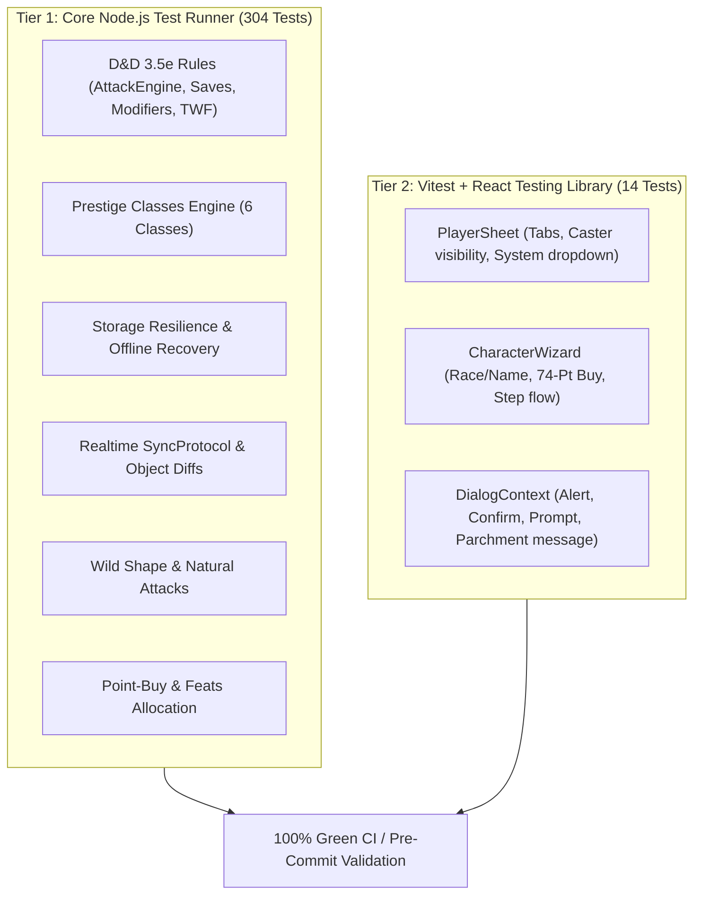

# Testing Strategy & Quality Assurance Specification

> **The Combatant (v6.0.0)** — D&D 3.5e Digital Combat Companion & Character Management System  
> Dual Test Architecture: **304 Core Node Tests + 14 Vitest React Testing Library Tests**

---

## 1. Test Architecture Overview

The application utilizes a dual-tier testing infrastructure ensuring both mathematical precision of D&D 3.5e RAW rules and flawless UI component behavior:



---

## 2. Test Execution Commands

```powershell
# Run all Core Node tests (304 tests)
npm run test

# Run a single core test file (fast, token-efficient)
node --import ./Tests/setup.js --test Tests/prestige.test.js

# Run all React UI tests with Vitest (14 tests)
npm run test:ui

# Run entire test suite (Core + UI)
npm run test:all

# Typecheck validation
npm run typecheck
```

---

## 3. Core Test Domains

### 3.1 D&D 3.5e RAW Rules & Calculations
- **Attack Engine:** Base Attack Bonus (BAB), Two-Weapon Fighting penalties, Power Attack slider, Weapon Finesse, Critical Threat range doubling (Keen / Improved Critical).
- **Modifier Stacking (`Stat.js`):** Enforces D&D rules where named bonuses of the same type do not stack (e.g. two +2 Enhancement bonuses yield +2), while Dodge, Circumstance, and Untyped bonuses stack cleanly.
- **Saving Throws:** Fortitude, Reflex, Will formula calculation across multi-classing and prestige progression.
- **Prestige Classes Engine (`js/rules/prestigeClassEngine.js`):** Prerequisite checks and automated feature grants for Arcane Trickster, Assassin, Battle Trickster, Eldritch Knight, Shadowbane Inquisitor, and Spellwarp Sniper.
- **Wild Shape:** Accurate attribute override, temporary HP recalculation from Constitution changes, natural weapons allocation (primary/secondary attacks), size modifier application, and clean state reversal on `exitShape()`.

### 3.2 Storage Resilience & Offline Recovery
- **Local-First Puffer:** Immediate synchronous persistence to `LocalStorageAdapter`.
- **Debounced Cloud Sync:** 800ms debounce batching to prevent Supabase request flood.
- **Network Drop Resilience:** Simulates connection drops during debounced saves; verifies that local data remains intact and synchronizes seamlessly once network is restored.

### 3.3 Realtime Synchronization Protocol
- **Shallow Object Diffs:** Transmits delta payloads (<30ms) between player devices and the DM Screen.
- **Array Hydration & Safeguard:** Prevents deletion of local character state on host disconnects.

---

## 4. BDD UI Component Specifications (Vitest / RTL)

### Scenario 1: Character Creation Wizard Flow
- **Given** the Character Wizard is opened at Step 1 (`Identity & Race`),
- **When** the player enters a valid character name and clicks `Next`,
- **Then** the Wizard advances to Step 2 (`Abilities (74 Pts)`),
- **And** highlights key class attributes when a reference class is selected.

### Scenario 2: Caster Tab Visibility on Player Sheet
- **Given** a non-caster character (e.g. Fighter) is loaded,
- **Then** the `Spellbook` tab is hidden.
- **When** a caster class (e.g. Wizard or Cleric) is added,
- **Then** the `Spellbook` tab dynamically appears in the navigation bar.

### Scenario 3: Declarative Dialog Context Modals
- **Given** an action requires user confirmation (e.g. resetting character data),
- **When** `showCustomConfirm()` is invoked via `DialogContext`,
- **Then** the ancient parchment modal appears on screen with sanitized HTML,
- **And** executes the confirmed callback only upon clicking `Confirm`.
