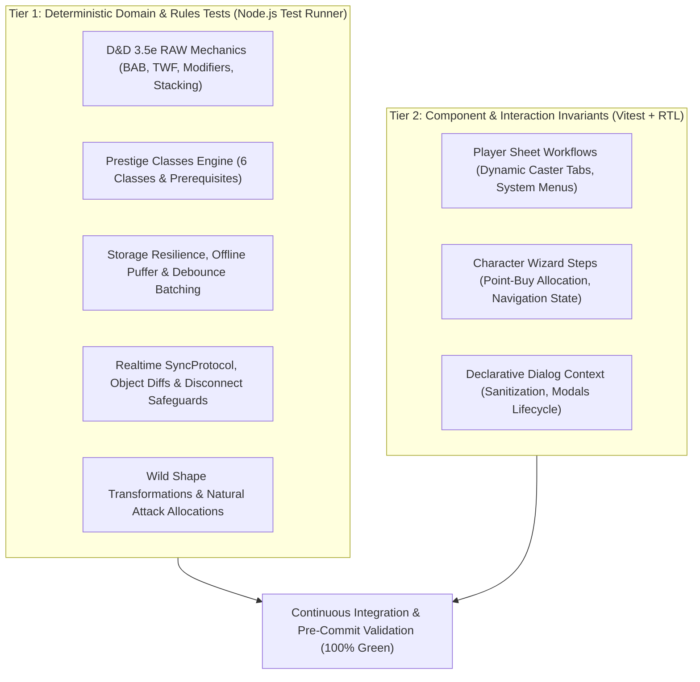

# Testing Strategy & Quality Assurance Architecture

> **The Combatant (v6.2.0)** — D&D 3.5e Digital Combat Companion & Character Management System  
> Dual Test Architecture: **311 Core Node Tests + 34 Vitest React Testing Library Tests (345 Total Tests)**

---

## 1. Testing Philosophy & Core Principles

The test suite of *The Combatant* is designed around **two distinct testing tiers** to ensure both mathematical rule correctness and responsive, crash-free tabletop usability:

### Core Invariants:
1. **Zero Math Deviation from D&D 3.5e RAW:** All calculations (stacking rules, bonus categorization, saving throws, attack penalty progression) must match the Official System Reference Document (SRD).
2. **Offline-First & Fault Resilience:** State persistence must never throw fatal exceptions upon network drops or cloud disconnects. Local storage serves as an immediate, infallible fallback.
3. **Behavioral UI Testing:** Component tests validate real user workflows, navigation, and DOM state transitions without mocking internal business logic.

---

## 2. Test Execution & Workflow Commands

| Scope | Command (PowerShell) | When to Use |
|---|---|---|
| **Core Suite** | `npm run test` | Validates all 311 rules, models, and storage suites |
| **Single Suite** | `node --import ./Tests/setup.js --test Tests/<file>.test.js` | Fast, token-efficient feedback during feature development |
| **UI Suite** | `npm run test:ui` | Runs all 34 Vitest + React Testing Library component tests |
| **Full Validation** | `npm run test:all` | Complete pre-release check (Core tests + UI tests) |
| **Typecheck** | `npm run typecheck` | Static TypeScript compiler check (`tsc --noEmit`) |

---

## 3. Test Domain Architecture

### 3.1 Rules & Mechanics Invariants (`Tests/*.test.js`)
- **Modifier Stacking Engine (`Stat.js`):** Enforces strict bonus type stacking (named bonuses of the same type do not stack; Dodge, Circumstance, and Untyped bonuses stack).
- **Combat & Attack Engines (`AttackEngine.js`):** Validates iterative attack penalties, Two-Weapon Fighting offsets, Power Attack damage multipliers, and weapon critical ranges.
- **Prestige Classes Engine (`prestigeClassEngine.js`):** Tests progression milestones, prerequisite validation, and automated feature grants across all 6 core prestige classes.
- **Wild Shape & Natural Weapons:** Validates physical stat overrides, size modifiers, Constitution-dependent HP recalculation, and primary/secondary natural attack matrices.

### 3.2 Storage & Network Resilience (`Tests/storage_*.test.js`)
- **Local-First Caching:** Verifies instantaneous local persistence before network synchronization.
- **Debounce Timing:** Asserts that rapid successive state mutations are batched within an 800ms window.
- **Connection Recovery:** Tests automatic retry and background cloud synchronization once network connectivity is re-established.
- **SyncProtocol Diffs:** Tests shallow path-based delta serialization, preventing payload bloat and host disconnect data-loss.

### 3.3 UI Interaction & State Invariants (`src/__tests__/*.test.tsx`)
- **Player Sheet & Tabs (`PlayerSheet.test.tsx`):** Asserts header stats, tab switching, and dynamic caster tabs (`Spellbook`).
- **Wizard Step Progression (`CharacterWizard.test.tsx`):** Validates multi-step form state preservation, 74-point buy budget constraints, and class key attribute highlights.
- **Level-Up Assistant (`LevelUp.test.tsx`):** Tests 4-step level advancement flow, ability score increase milestones, feat slots, and review state.
- **Printable Character Sheet Folio (`PrintableCharacterSheet.test.tsx`):** Verifies 4-page A4 rendering, page breakdown integrity, saving throw extractions, and companion sub-sheet.
- **ACF Restrictions & Swapping (`ACFRestrictions.test.tsx`):** Tests ACF prerequisite checks, exclusivity conflicts, and automatic replacement swapping.
- **Modal Lifecycle & Security (`Modals.test.tsx`):** Validates declarative modal mounting, DOMPurify HTML sanitization, and callback execution.

---

## 4. Guidelines for Adding New Tests

1. **Domain & Rules Logic:**
   - Create tests in `Tests/<domain>.test.js` using native Node.js test runner (`node:test` and `node:assert/strict`).
   - Keep tests deterministic and free of DOM dependencies.
2. **React Components & UI Workflows:**
   - Create tests in `src/__tests__/<Component>.test.tsx` using Vitest, React Testing Library, and the custom `renderWithProviders()` helper.
   - Query elements using user-centric accessible roles (`getByRole`, `getByText`, `getByPlaceholderText`).
