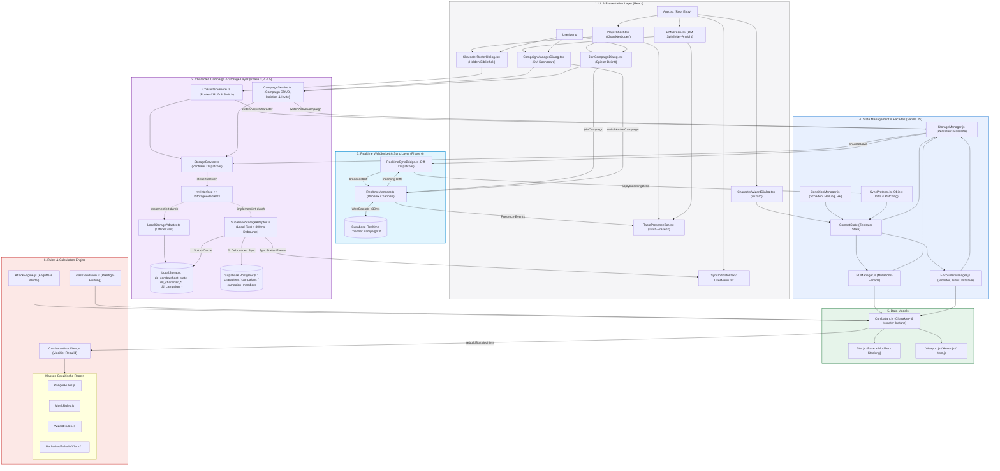

# System-Architektur & Kommunikationswege (CombatApp)

Dieses Diagramm visualisiert die verschiedenen Ebenen (Layer) der Anwendung, die Datenmodelle, die Regelberechnungs-Engines, den Multi-Character Roster, das DM Multi-Campaign Dashboard und den Supabase Realtime WebSocket Sync-Flow.

## Beschreibung der Kommunikationswege

1. **User Action & UI (React)**: 
   Änderungen an Werten (z. B. Schaden eintragen oder Talente lernen) werden von React-Komponenten über den `CombatState` (Zustandsschicht) verarbeitet.

2. **Realtime WebSocket Synchronisation (Phase 6)**:
   DM und Spieler treten beim Öffnen einer Kampagne automatisch dem Supabase WebSocket-Kanal `campaign:<campaignId>` bei.
   * Jede Mutation an HP, Status oder Rundenstand erzeugt ein flaches Diff über `SyncProtocol.getObjectDiff()`.
   * Das Diff wird über `RealtimeManager.broadcastDiff()` in <30ms an alle verbundenen Spieler gestreamt.
   * Die `TablePresenceBar.tsx` zeigt live alle am Tisch anwesenden Spieler mit Avatar und Verbindungsstatus an.
   * **PeerJS/WebRTC wurde vollständig aus dem Projekt entfernt.**

3. **Multi-Character Management (Phase 4)**:
   Über den `CharacterRosterDialog.tsx` können Spieler ihre Helden-Bibliothek verwalten. `CharacterService.ts` ermöglicht das Erstellen, Duplizieren, Löschen und unterbrechungsfreie **Zero-Loss Switching** von Charakteren.

4. **DM Multi-Campaign Dashboard (Phase 5)**:
   Spielleiter können über `CampaignManagerDialog.tsx` beliebig viele D&D-Kampagnen anlegen und verwalten mit individuellem Einladungscode (`RAVEN-42`) und vollständig isoliertem Encounter-Zustand.

5. **Storage & Cloud-Sync (Phase 3 Adapter-Pattern)**:
   Jede State-Mutation ruft `saveToStorage()` auf. `StorageManager.js` delegiert an den `StorageService.ts`:
   * **Gast:** `LocalStorageAdapter.ts` speichert direkt synchron im `localStorage`.
   * **Supabase:** `SupabaseStorageAdapter.ts` puffert synchron im lokalen Cache und sendet nach 800ms Debounce einen Cloud-Upsert.
