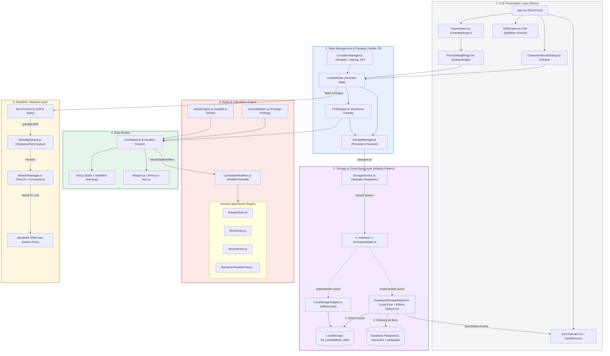

# System-Architektur & Kommunikationswege (CombatApp)

Dieses Diagramm visualisiert die verschiedenen Ebenen (Layer) der Anwendung, die Datenmodelle, die Regelberechnungs-Engines, den Storage- & Cloud-Sync-Layer (Supabase / LocalStorage) sowie den Peer-Sync-Flow.

## Beschreibung der Kommunikationswege

1. **User Action & UI (React)**: 
   Änderungen an Werten (z. B. Schaden eintragen oder Talente lernen) werden von React-Komponenten über die `ReactDialogBridge` oder direkt an den `CombatState` (Zustandsschicht) weitergeleitet.
   
2. **State Mutation**:
   `CombatState` delegiert die physische Mutation an den `PCManager` (für Charakterdaten) oder den `ConditionManager` (für HP/Statusänderungen). 

3. **Storage & Cloud-Sync (Phase 3 Adapter-Pattern)**:
   Jede State-Mutation ruft `saveToStorage()` auf. `StorageManager.js` delegiert an den `StorageService.ts`:
   * **Gast / Nicht eingeloggt:** `LocalStorageAdapter.ts` speichert direkt synchron im `localStorage`.
   * **Eingeloggt mit Supabase:** `SupabaseStorageAdapter.ts` speichert den State synchron im lokalen Backup-Cache und sendet nach 800ms Debounce-Inaktivität einen kombinierten Cloud-Upsert (`characters`- bzw. `campaigns`-Tabelle).
   * **Visuelles Feedback:** Statusübergänge (`idle` $\rightarrow$ `saving` $\rightarrow$ `saved` $\rightarrow$ `idle` / `error`) werden über `useSyncStatus()` an den `SyncIndicator.tsx` im Header gestreamt.
   * **Flush-Garantie:** Bei Browser-Schließen oder Reload triggert ein `beforeunload`-Listener `flushPendingSaves()`.

4. **Reaktive Modifikatoren-Neuberechnung (Modelle & Regeln)**:
   Nach jeder Zustandsänderung ruft der `Combatant` intern `rebuildStatModifiers()` auf. Dieser Prozess:
   * Leert alle flüchtigen Modifikatoren in den `Stat`-Klassen.
   * Läuft durch `CombatantModifiers.js` und fragt Rasse, Ausrüstung und Klasseneffekte (über die jeweiligen Klassenregel-Dateien wie `RangerRules.js` oder `MonkRules.js`) ab.
   * Injiziert die Modifikatoren neu in die `Stat`-Objekte, welche über `getValue()` (in `Stat.js`) unter Berücksichtigung von Stacking-Regeln (Dodge/Untyped addieren, andere Typen nur das Maximum) den Endwert berechnen.

5. **Synchronisation (Netzwerk & Session)**:
   Jede State-Änderung triggert das `SyncProtocol.js`. Dieses berechnet ein flaches JSON-Diff (`getObjectDiff`). Das Diff wird über die `MessageQueue.js` (die Verbindungsabbrüche abfedert) an den `NetworkManager.js` gereicht und per **WebRTC** an andere Teilnehmer (DM oder Spieler) gesendet, welche das Diff mittels `applyObjectDiff` lokal anwenden.
