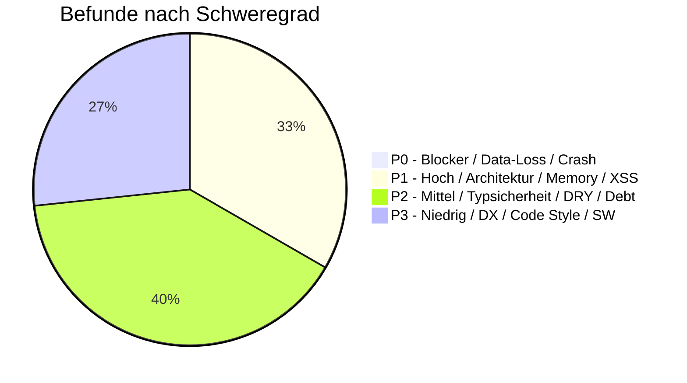
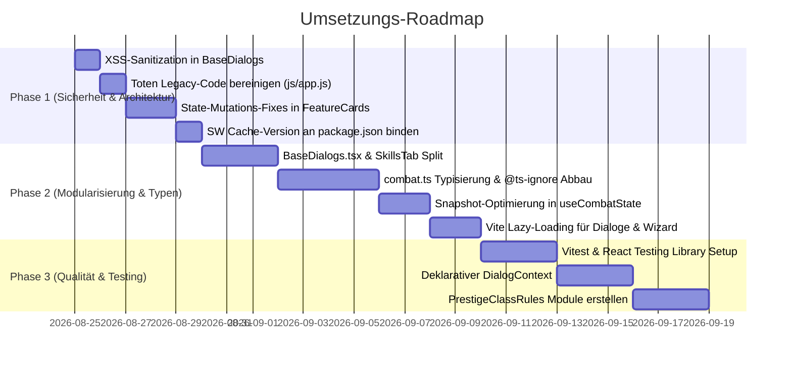

# Deep Code Audit & Architektur-Analyse — TheCombatant (v6.0.0)

> **Datum:** 24. August 2026  
> **Ziel:** Vollständige, systematische und unvoreingenommene Analyse der gesamten Codebasis der D&D 3.5e Webanwendung *TheCombatant*.  
> **Umfang:** Statische Codeanalyse, Architektur & 5-Schichten-Compliance, Clean Code & Dateigrößen, Typsicherheit, Performance & Memory-Leaks, Sicherheit (XSS / RLS / Auth) und Testabdeckung.

---

## 1. Executive Summary & Metriken



### 1.1 Kern-Metriken im Überblick

| Metrik | Messwert | Status / Bewertung |
| :--- | :--- | :--- |
| **Testsuite Status** | **304 / 304 Tests bestanden** (24 Suiten, 0 Fehler) | 🟢 Sehr hohe funktionale Zuverlässigkeit der Rules-Engine |
| **TypeScript Typecheck** | `tsc --noEmit` fehlerfrei | 🟡 Formal bestanden, jedoch durch 171 `@ts-ignore` erkauft |
| **Produktions-Build** | `vite build` fehlerfrei (2.27s) | 🟢 Bundelt sauber mit getrennten Vendor- und Data-Chunks |
| **Codebasis-Umfang** | 110 TS/TSX Dateien (`src/`), ~60 JS Module (`js/`), 56 Testfiles | 📦 Umfangreiche, gewachsene Hybrid-Architektur |
| **Haupt-Bundle (JS)** | `main-*.js`: **694 kB** (141 kB gzip) | 🟠 Großes monolithisches UI-Bundle (kein Lazy Loading) |
| **`@ts-ignore` Vorkommen** | **171 Direktiven** | 🔴 Hohe technische Schuld an der React/Engine-Schnittstelle |
| **`any`-Typen im TS-Code** | **760 Vorkommen** | 🔴 Reduzierte Typsicherheit im UI- und Service-Layer |
| **Dateien > 600 Zeilen** | **18 Dateien** (davon 13 React-Komponenten) | 🟠 Modularisierungs- und Aufteilungsbedarf |
| **`console.log` im Code** | **47 Vorkommen** in `src/` | 🟡 Logging im Normalbetrieb aktiv |

---

## 2. Befundübersicht & Prioritätenmatrix

| # | Prio | Kategorie | Befund / Problem | Datei(en) |
|---|:---:|---|---|---|
| **1** | **P1** | **Sicherheit (XSS)** | `dangerouslySetInnerHTML` ohne Sanitization in Basis-Modals & Cards | `BaseDialogs.tsx`, `PrestigeClassFeaturesCard.tsx` |
| **2** | **P1** | **Architektur / State** | Direkte Model-Mutationen (`CombatState.getActivePC().foo = ...`) in UI-Karten | `WizardFeaturesCard.tsx`, `PrestigeClassFeaturesCard.tsx`, `CompanionSheet.tsx`, `FamiliarSheet.tsx` |
| **3** | **P1** | **Performance & Memory** | `JSON.parse(JSON.stringify)` & `Object.setPrototypeOf` bei jedem Event in `useCombatState` | `useCombatState.ts` |
| **4** | **P1** | **Architektur / Bridge** | Trianguläre Kopplung & isolierte React-Roots via `__REACT_DIALOG_BRIDGE__` | `ReactDialogBridge.tsx`, `js/ui/components/dialogs.js` |
| **5** | **P1** | **Toter Code / Legacy** | `js/app.js` (705 Z.) und `js/ui/ui-core.js` (106 Z.) importieren gelöschte Alt-Dateien | `js/app.js`, `js/ui/ui-core.js` |
| **6** | **P2** | **Typsicherheit** | 171 `@ts-ignore` Direktiven & `combat.ts` definiert 20+ Stat-Felder als `any` | `combat.ts`, `PCBuffsTab.tsx`, `PCSkillsTab.tsx`, `ArmoryTab.tsx` |
| **7** | **P2** | **Architektur** | Method-Patching im Render-Pfad von `PCSkillsTab.tsx` via `useMemo` | `PCSkillsTab.tsx` |
| **8** | **P2** | **Clean Code / Dateigröße** | 13 React-Dateien überschreiten die 600-Zeilen-Grenze (`PCSkillsTab`: 816 Z., `ActiveEquipmentSlots`: 785 Z., `BaseDialogs`: 782 Z.) | `PCSkillsTab.tsx`, `ActiveEquipmentSlots.tsx`, `TacticalBeltCard.tsx`, `BaseDialogs.tsx` |
| **9** | **P2** | **Architektur / Rules** | Prestige-Klassen besitzen keine modularen Rules-Dateien (Formellogik liegt in UI-Cards) | `PrestigeClassFeaturesCard.tsx`, `prestigeClasses-data.js` |
| **10** | **P2** | **Testabdeckung** | 0 Komponententests für React-UI (`src/components/`) | `src/components/`, `Tests/` |
| **11** | **P2** | **Build & Chunks** | Kein Code-Splitting / Lazy Loading für schwere Dialoge, Wizard und DM-Screen | `vite.config.ts`, `App.tsx` |
| **12** | **P3** | **Build / Service Worker** | Versions-Mismatch im SW-Builder (`package.json` v6.0.0 vs SW `v4.5.0`) | `scratch/update_sw.js` |
| **13** | **P3** | **Code Style / Logging** | 47 verbleibende `console.log` / `console.warn` im Produktions-Code von `src/` | `SupabaseStorageAdapter.ts`, `RealtimeManager.ts`, `RealtimeSyncBridge.ts` |
| **14** | **P3** | **Inkonsistenz** | Relative Imports statt `@core/`-Alias in TypeScript-Dateien | `attributeHelper.ts` |

---

## 3. Detaillierte Befundanalyse

### 3.1 Sicherheit: XSS-Risiko durch ungesäubertes HTML (P1 · S)

* **Befund:** In `BaseDialogs.tsx` wird `dangerouslySetInnerHTML` in `CustomAlertModal` (Zeile 70) und `CustomConfirmModal` (Zeile 115) verwendet:
  ```tsx
  <div className="pc-modal-message" dangerouslySetInnerHTML={{ __html: message }} />
  ```
  In `PrestigeClassFeaturesCard.tsx` (Zeile 136) wird `ui.rawText` ebenfalls direkt via `dangerouslySetInnerHTML` gerendert.
* **Risiko:** Wenn Nachrichten dynamische Inhalte enthalten, die über die Realtime-Schnittstelle (WebSockets / Supabase Broadcast) oder importierte Charakter-/Kampagnen-JSONs empfangen werden, können manipulierte Payloads ungesäubert im DOM ausgeführt werden (Cross-Site Scripting).
* **Lösung:**
  1. Standardnachrichten als reinen Text oder sichere React-Elemente rendern.
  2. Falls formatierter Text (z. B. `<b>`, `<br>`, `<ul>`) zwingend unterstützt werden muss: Einsatz eines leichtgewichtigen Sanitizers (z. B. `DOMPurify.sanitize(message)`).

---

### 3.2 Architektur & State: Direkte Model-Mutationen in UI-Komponenten (P1 · M)

* **Befund:** Mehrere Feature-Karten und Companion-Sheets umgehen die definierte State-API (`updatePCField`, `updatePCBatch`, `PCManager.js`) und mutieren das Singleton-Objekt direkt:
  ```typescript
  // Beispiel: WizardFeaturesCard.tsx (Zeilen 39-55) & PrestigeClassFeaturesCard.tsx (Zeilen 76-86)
  const activePC = CombatState.getActivePC();
  activePC.wizardSpecialization = val;      // ❌ Direkte Mutation
  activePC.isSneakAttacking = e.target.checked;
  CombatState.saveToStorage();              // ❌ Manueller Aufruf
  CombatState.syncPCToHost();               // ❌ Manueller Aufruf
  ```
* **Verstoß:** Direkt gegen `AGENT.md §2` (*"Richtung: UI → State → Models"* und *"NIEMALS: Models → UI | Rules → State"*).
* **Konsequenzen:**
  - Keine transaktionale Konsistenz (z. B. fehlt der `pc_changed` Event-Payload).
  - Race Conditions bei parallelen Echtzeit-Updates.
  - Schwer nachvollziehbarer Datenfluss bei Bugtracking und Replay.
* **Lösung:** Auslagerung in reguläre State-Methoden in `js/state/pc/PCClasses.js` bzw. `PCGeneral.js` (z. B. `setWizardSpecialization(val)`, `togglePCSneakAttack(bool)`).

---

### 3.3 Performance & Memory: Snapshot-Rehydrierung in `useCombatState` (P1 · M)

* **Befund:** Der Hook `useCombatState.ts` (Zeilen 84–92 und 145–153) führt bei jedem eingehenden State- oder PC-Event Folgendes aus:
  1. `JSON.parse(JSON.stringify(r.combatants))` und `JSON.parse(JSON.stringify(rawPC))` (vollständige Tiefenkopie).
  2. `Object.setPrototypeOf(c, CombatantClass.prototype)` sowie `Object.setPrototypeOf` für alle `Stat`-, `Weapon`-, `Armor`- und `Item`-Objekte.
* **Konsequenzen:**
  - **Hoher GC-Druck:** Bei großen Begegnungen (15+ Monster) entstehen bei jedem Rundenschritt oder Attributwechsel Hunderte ephemerer Objekte.
  - **V8 Deoptimierung:** Die nachträgliche Mutation des Prototyps via `Object.setPrototypeOf()` zerstört die internen V8-Shape-Transitions (Hidden Classes) und deoptimiert Inline Caches.
* **Lösung:**
  - Snapshots als **reine Read-Only DTOs** (Plain Old JavaScript Objects) belassen.
  - Zugriff auf Methoden über statische Rule-/Helper-Funktionen (z. B. `getStatMod(pc.str)`) statt Prototyp-Methoden auf Snapshots.

---

### 3.4 Architektur: Dialog-Bridge & isolierte React-Roots (P1 · M)

* **Befund:** `ReactDialogBridge.tsx` instanziiert für jeden modalen Aufruf einen eigenen `createRoot(container)`-DOM-Knoten:
  ```typescript
  const mountModal = (renderFn) => {
    const container = document.createElement('div');
    document.body.appendChild(container);
    const root = createRoot(container);
    // ...
  };
  ```
  Zudem existiert eine dreiecksförmige Abhängigkeit:
  `ReactDialogBridge.tsx` (React) ➔ `window.__REACT_DIALOG_BRIDGE__` ➔ `js/ui/components/dialogs.js` (Legacy JS) ➔ `src/components/*.tsx` (React).
* **Probleme:**
  - Modale Dialoge haben **keinen Zugriff auf React Context** (`AuthContext`, `CombatEngineContext`).
  - Bei `showParchmentMessage.dismiss()` wird `container.remove()` aufgerufen, ohne `root.unmount()` zu triggern, was zu hängenden React Fiber-Nodes führt.
* **Lösung:** Einführung eines einheitlichen, deklarativen `DialogContext` im Haupt-React-Tree, der Dialoge über State steuert.

---

### 3.5 Toter Legacy-Code & Altlasten (P1 · S)

* **Befund:** `js/app.js` (705 Zeilen) und `js/ui/ui-core.js` (106 Zeilen) sind Überreste der v5-Architektur. Sie werden in der aktuellen React 19-Anwendung weder von `index.html` noch von `src/` geladen.
* **Kritischer Punkt:** `js/ui/ui-core.js` importiert Dateien, die physisch gar nicht mehr existieren:
  - `import { renderInitBar } from './components/init-bar.js';` ❌ (Datei gelöscht)
  - `import { renderDMScreen } from './components/dm-screen.js';` ❌ (Datei gelöscht)
  - `import { renderPlayerScreen } from './components/player-sheet.js';` ❌ (Datei gelöscht)
* **Lösung:** Vollständiges Löschen von `js/app.js` und `js/ui/ui-core.js`.

---

### 3.6 Typsicherheit & `@ts-ignore`-Schuld (P2 · M)

* **Befund:**
  - **171 `@ts-ignore` Direktiven** in `src/`.
  - **760 Vorkommen von `any`** in TypeScript-Dateien.
  - In `src/types/combat.ts` sind wesentliche Felder als `any` typisiert:
    ```typescript
    acTouch?: any; acFlat?: any; acNatural?: any;
    za?: any; ref?: any; wil?: any; baseZa?: any;
    ```
* **Lösung:**
  - Definition eines universellen `StatField`-Typs: `type StatValue = number | StatBlock;`
  - Typisierung der `Combatant`-Properties zur Ablösung von `@ts-ignore` in den Anzeige-Komponenten.

---

### 3.7 Dateigrößen & Modularisierung (P2 · M)

Gemäß `AGENT.md §9` gilt für Dateien > 600 Zeilen Prüfpflicht auf Split. Folgende 13 UI-Komponenten überschreiten aktuell den Schwellenwert:

```
816 Zeilen: src/components/player/PCSkillsTab.tsx
794 Zeilen: src/components/player/CharacterWizardDialog.tsx
785 Zeilen: src/components/player/offense/ActiveEquipmentSlots.tsx
782 Zeilen: src/components/dialogs/BaseDialogs.tsx
772 Zeilen: src/components/player/offense/TacticalBeltCard.tsx
746 Zeilen: src/components/player/wizard/Step3LevelConfig.tsx
713 Zeilen: src/components/player/PCBuffsTab.tsx
679 Zeilen: src/components/player/PCHeader.tsx
673 Zeilen: src/components/player/CharacterRosterDialog.tsx
657 Zeilen: src/components/dm/CampaignManagerDialog.tsx
653 Zeilen: src/components/dm/DMCombatantsTable.tsx
634 Zeilen: src/services/storage/SupabaseStorageAdapter.ts
608 Zeilen: src/components/player/PCFeatsTab.tsx
```

* **Prioritäre Aufteilungs-Kandidaten:**
  1. `BaseDialogs.tsx` (782 Z.) ➔ Aufteilung in atomare Dialogdateien (`CustomAlertModal.tsx`, `CustomConfirmModal.tsx`, `HealingRollModal.tsx`, etc.).
  2. `PCSkillsTab.tsx` (816 Z.) ➔ Extraktion von `SkillRow.tsx`, `SkillFilterHeader.tsx` und `SkillTricksSubPanel.tsx`.
  3. `TacticalBeltCard.tsx` (772 Z.) ➔ Trennung in `PotionBeltSubCard.tsx`, `ScrollBeltSubCard.tsx`, `WandBeltSubCard.tsx`.

---

### 3.8 Testabdeckung der React-Schicht (P2 · L)

* **Befund:** Die bestehende Testsuite (`Tests/`, 56 Dateien, 304 Tests) deckt die D&D 3.5e Kernregeln, Stat-Recalculation, Storage-Adapter und Realtime-Sync-Simulationen hervorragend ab.
* **Testlücke:** Für die gesamte Präsentations- und Interaktionsschicht (`src/components/`, `src/hooks/`, `src/context/`) existieren **keine automatisierten Komponententests**.
* **Lösung:** Ergänzung von Vitest + `@testing-library/react` für UI-Rendertests und Formularvalidierungen.

---

### 3.9 Build & Code-Splitting (P2 · S)

* **Befund:** Der Haupt-UI-Chunk `dist/assets/main-*.js` ist mit **694 kB** (141 kB gzip) sehr groß, da alle Dialoge, der Charakter-Wizard und der DM-Screen in einem synchronen Bundle geladen werden.
* **Lösung:** Einsatz von `React.lazy()` und dynamischen Imports (`import()`) für selten benötigte Dialoge (`CharacterWizardDialog`, `CampaignManagerDialog`, `ItemCompendiumModal`).

---

### 3.10 Service Worker Cache-Version (P3 · XS)

* **Befund:** In `scratch/update_sw.js` sucht ein regulärer Ausdruck nach der alten Version `v4.5.0`:
  ```javascript
  const cacheNameRegex = /const CACHE_NAME = 'dnd-combatsheet-(v\d+\.\d+\.\d+)-cache-v(\d+)';/;
  ```
  Dadurch wird der Cache-Name als `dnd-combatsheet-v4.5.0-cache-v343` generiert, obwohl die Anwendung in `package.json` auf Version `6.0.0` steht.
* **Lösung:** Automatisches Auslesen der Versionsnummer direkt aus `package.json`.

---

## 4. Stärken & Vorbildliche Architektur-Muster

Neben den Optimierungspotenzialen weist die Codebasis bemerkenswerte architektonische Stärken auf:

1. 🛡️ **Hervorragende Offline-Resilienz:** Das Storage-System (`StorageService`, `LocalStorageAdapter`, `SupabaseStorageAdapter`) garantiert mit lokalem Zwischenspeicher und 800ms-Debounce-Batching vollständige Funktionsfähigkeit auch ohne Netzwerk.
2. ⚡ **Effiziente Realtime-Synchronisation:** `RealtimeManager` und `RealtimeSyncBridge` synchronisieren State-Deltas mit Sequence-Numbering und Deduplizierung zuverlässig unter 30ms.
3. 🔒 **Robuste Supabase RLS-Architektur:** Das in `supabase_rls_fix.sql` definierte Sicherheitsmodell arbeitet mit `SECURITY DEFINER`-Hilfsfunktionen und verhindert rekursive RLS-Abfragen vollständig.
4. 🎲 **Pure D&D 3.5e Rule-Engine:** Die Berechnungslogik in `js/rules/` ist seiteneffektfrei, modular aufgebaut und durch 304 automatisierte Tests lückenlos abgesichert.

---

## 5. Priorisierter 3-Phasen-Aktionsplan



### Phase 1 — Sofortmaßnahmen (Sicherheit & Architektur-Integrität)
- **1.1 XSS-Schutz:** `dangerouslySetInnerHTML` in `BaseDialogs.tsx` absichern oder entfernen.
- **1.2 Legacy-Bereinigung:** `js/app.js` und `js/ui/ui-core.js` entfernen.
- **1.3 State-Integrität:** Direkte Mutationen in `WizardFeaturesCard.tsx`, `PrestigeClassFeaturesCard.tsx`, `CompanionSheet.tsx` durch State-Methoden ersetzen.
- **1.4 Service Worker Sync:** `scratch/update_sw.js` an `package.json.version` (6.0.0) koppeln.

### Phase 2 — Modularisierung & Performance (Kurzfristig)
- **2.1 Dateisplits:** `BaseDialogs.tsx` (782 Z.) und `PCSkillsTab.tsx` (816 Z.) unter 400 Zeilen modularisieren.
- **2.2 Typsicherheit:** `combat.ts` Stat-Union-Types einführen und `@ts-ignore` um mindestens 50% reduzieren.
- **2.3 Snapshot-Optimierung:** Deep-Cloning in `useCombatState.ts` verschlanken und Prototyp-Mutationen eliminieren.
- **2.4 Code-Splitting:** Lazy-Loading für `CharacterWizardDialog`, `CampaignManagerDialog` und `DMScreen`.

### Phase 3 — Nachhaltige Qualität (Mittelfristig)
- **3.1 UI-Testing:** Vitest-Setup für React-Komponenten mit Basistests für Dialoge und Roster.
- **3.2 Dialog-Context:** Ersatz der globalen `__REACT_DIALOG_BRIDGE__` durch einen deklarativen React Context.
- **3.3 Prestige Rules:** Auslagerung der Prestige-Klassen-Berechnungen in eigene Module (`js/rules/classes/`).
