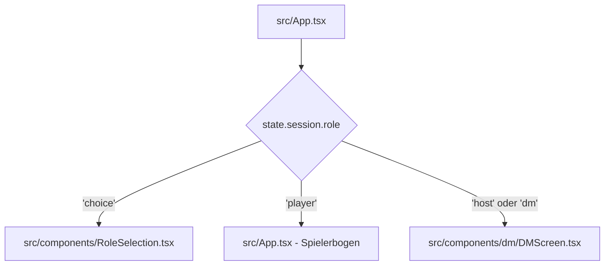

# Migrationsplan: Milestone 4 — Dungeon Master Screen & Initiative-Leiste

Dieses Dokument beschreibt das Vorgehen für **Milestone 4** der React + Vite + TypeScript Migration der D&D 3.5e Combat App. In diesem Meilenstein wird die gesamte Spielleiter-Oberfläche (Dungeon Master Screen) inklusive der Drag-and-Drop Initiative-Leiste in React portiert.

---

## 1. Übersicht & Ziele für Milestone 4
Das Ziel von Milestone 4 ist es, den DM-Screen vollständig zu migrieren und nahtlos in das bestehende React-Layout einzubinden.

### Zu migrierende Vanilla-Module:
1. **Rollen-Auswahl** (`roleSelectionOverlay` aus `index.html` und `_initRoleSelectionEvents` aus `js/app.js`)
2. **DM-Header & Metadaten** (`js/ui/components/dm/DMHeader.js` und `index.html`)
3. **Initiative-Leiste (Drag-and-Drop)** (`js/ui/components/init-bar.js`)
4. **DM-Kämpfer-Tabelle** (`js/ui/components/dm/DMCombatantsTable.js` - inklusive der in M3 verfeinerten Companion-Inline-Darstellung)
5. **DM-Werkzeuge & Botschaften** (`js/ui/components/dm/DMToolbox.js` und `js/ui/dialogs/BaseDialogs.js`)
6. **Regel-Schnellreferenz-Modal** (`refOverlay` aus `index.html`)

---

## 2. Architektur & Routing in App.tsx
Wir führen ein einfaches, zustandsbasiertes Routing in `src/App.tsx` auf Root-Ebene ein, um die richtige Benutzeroberfläche basierend auf der ausgewählten Rolle (`state.session.role`) anzuzeigen:



---

## 3. Vorgeschlagene Änderungen & Komponenten-Struktur

### 3.1. Neue React-Komponenten

#### [NEW] [RoleSelection.tsx](file:///c:/Users/Juls/Desktop/CombatApp/src/components/RoleSelection.tsx)
Rendert den Rollen-Auswahlschirm (DM vs. PC) unter Verwendung der in `popups.css` definierten Klassen (`.role-overlay`, `.role-container` etc.). Setzt den Status über `CombatState.setRole('dm')` bzw. `CombatState.setRole('player')`.

#### [NEW] [DMScreen.tsx](file:///c:/Users/Juls/Desktop/CombatApp/src/components/dm/DMScreen.tsx)
Die Hauptkomponente des Spielleiter-Bildschirms. Koordiniert den Header, die Initiative-Leiste, die Spalten für Spieler/Gegner und die rechte Toolbox-Spalte. Ermöglicht auch das Zurückwechseln zur Rollenauswahl ("Swap Role").

#### [NEW] [DMHeader.tsx](file:///c:/Users/Juls/Desktop/CombatApp/src/components/dm/DMHeader.tsx)
Rendert die Runden-Anzeige und die Metadaten-Eingabefelder für Begegnung, Ort, XP-Budget, verteilte XP und Sitzungsnummer. Synchronisiert alle Änderungen über `CombatState.updateMeta`.

#### [NEW] [InitBar.tsx](file:///c:/Users/Juls/Desktop/CombatApp/src/components/dm/InitBar.tsx)
Die Initiative-Leiste oben auf dem Bildschirm.
- Zeigt alle aktiven Kämpfer sortiert nach Initiative an.
- Unterstützt **HTML5 Drag-and-Drop**, um die Reihenfolge der Kämpfer manuell anzupassen.
- Ändert den aktiven Zug beim Klicken auf einen Slot.
- Zeigt Zustands-Motes (Conditions) und einen HP-Verlaufsbalken unter dem Namen an.

#### [NEW] [DMCombatantsTable.tsx](file:///c:/Users/Juls/Desktop/CombatApp/src/components/dm/DMCombatantsTable.tsx)
Rendert die Tabellen für Spieler-Charaktere (`p`) und Gegner/NSCs (`e`/`n`) getrennt.
- **Companion-Inline-Anzeige**: Tierbegleiter und Vertraute werden direkt leicht eingerückt unter ihrem Meister gelistet.
- Bietet direkte Eingabefelder für HP, RK (3-fach Box), Initiative-Wurf und Saves (Zä/Ref/Wil).
- Schadens-, Heilungs- und Temp-HP-Controller.
- Begleiter-Recall-Buttons, falls ein Begleiter gerufen werden kann, aber noch nicht im Kampf ist.

#### [NEW] [DMToolbox.tsx](file:///c:/Users/Juls/Desktop/CombatApp/src/components/dm/DMToolbox.tsx)
Rechte Spalte des DM-Screens:
- **Konzentrations-Tracker**: Liste aller aktiven Konzentrationszauber mit Runden-Countdowns.
- **Nachrichtensender**: Formular zum Versenden von geheimen Pergament-Nachrichten an einzelne Spieler oder alle.
- **Schnellreferenz-Chips**: Grid aller Bedingungen, die beim Anklicken das Referenz-Modal öffnen.

#### [NEW] [RefOverlay.tsx](file:///c:/Users/Juls/Desktop/CombatApp/src/components/dm/RefOverlay.tsx)
Ein Modal-Dialog zur Anzeige von Detailbeschreibungen zu Zuständen und D&D-Regelbegriffen aus `CombatRules.CONDITIONS`.

---

### 3.2. Geänderte Komponenten

#### [MODIFY] [App.tsx](file:///c:/Users/Juls/Desktop/CombatApp/src/App.tsx)
- Führt den Rollen-Check aus:
  - Wenn `state.session.role === 'choice'`, rendert `<RoleSelection />`.
  - Wenn `state.session.role === 'host'` (oder `state.session.role === 'dm'`), rendert `<DMScreen />`.
  - Wenn `state.session.role === 'player'`, rendert das bestehende Spieler-Layout.
- Fügt einen "Rolle wechseln" Button in das Systemmenü oder Layout ein, um zurück zu `'choice'` wechseln zu können.

---

## 4. Verifikationsplan

### Automatisierte Tests
Die Testsuite muss zu jedem Zeitpunkt grün bleiben:
```powershell
node --import ./Tests/setup.js --test Tests/**/*.test.js
```
*Erwartetes Ergebnis:* 186/186 Tests erfolgreich.

### Manuelle Verifikation
1. **Rollenwechsel**: Starte den Vite-Server, öffne die App, wähle "Spielleiter (DM)" und prüfe, ob der DM-Screen geladen wird. Wechsle über das Menü zurück zur Rollenauswahl und gehe in den "Spieler (PC)" Modus.
2. **Initiative-Verschiebung**: Ziehe im DM-Screen einen Kämpfer in der Initiative-Leiste an eine andere Position und prüfe, ob sich die Reihenfolge und der aktive Zug korrekt aktualisieren und persistieren.
3. **Schadens- & Heilungs-Zuweisung**: Weise einem Kämpfer Schaden zu und heile ihn wieder. Überprüfe die farbliche HP-Balken-Aktualisierung in Echtzeit.
4. **Begleiter-Recall**: Klicke bei einem Spieler-Charakter (z.B. Gildor) auf den Begleiter-Rufbutton und kontrolliere, ob der Begleiter inline eingerückt in der Liste und in der Initiative-Leiste erscheint.
5. **Botschaften versenden**: Sende eine Spielleiter-Botschaft an "Alle Spieler" und stelle sicher, dass keine Fehler in der Konsole auftreten.
6. **Regelsuche**: Klicke in der Schnellreferenz auf "Erschüttert" (Shaken) und prüfe, ob das Overlay mit dem korrekten Regeltext erscheint und sich wieder schließen lässt.
7. **Vite Production Build**: Führe `npm run build` aus, um sicherzustellen, dass keine Kompilierungsfehler im Bundle entstehen.
