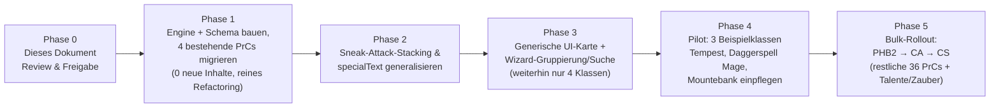

# Implementierungsplan: Prestige-Klassen-Architektur für die Regelbuch-Erweiterung

Dieses Dokument ist ein **Planungsdokument zur Review** – es beschreibt Architekturentscheidungen, Refactorings und ein Umsetzungskonzept für die Integration der 39 neuen Prestige-Klassen aus Player's Handbook II (PHB2), Complete Adventurer (CA) und Complete Scoundrel (CS). Es enthält **keine Code-Änderungen**; diese folgen erst nach Freigabe der hier getroffenen Entscheidungen.

> [!NOTE]
> **Status (21.08.2026): Phase 1, 2 und 3 sind implementiert, getestet und commit-bereit.** Phase 4 (Pilotklassen Tempest/Daggerspell Mage/Mountebank) und Phase 5 (Bulk-Rollout) sind noch offen und warten auf Freigabe. Details zum tatsächlichen Umsetzungsstand inkl. während der manuellen QA gefundener Zusatz-Bugfixes siehe **Abschnitt 10** am Ende dieses Dokuments.

---

## 0. Ausgangslage

Aktuell sind 4 Prestige-Klassen vollständig implementiert und `main`-gemerged: **Mystischer Theurge, Arkaner Trickser, Drachen-Jünger, Assassine** (PR #17, Commit `a890acc`). Die ursprüngliche Annahme, der Assassine sei nur eine Testimplementierung, ist **widerlegt** – er ist genauso vollständig wie die anderen drei (Datenmodell, Regelvalidierung, Zauberslot-Tabelle, UI-Karte, Charaktererstellungs-Assistent, Stufenaufstiegs-Dialog, dedizierte Tests in `Tests/prestige.test.js`).

Mit den 3 neuen Regelbüchern kommen **39 weitere Prestige-Klassen** hinzu (insgesamt 43). Das ist der Auslöser für diese Architekturprüfung: Das aktuelle Muster skaliert nicht auf diese Menge, weder Backend- noch UI-seitig – aber aus unterschiedlichen Gründen, wie die folgende Analyse zeigt.

---

## 1. Ist-Stand: Das Hybrid-Pattern

Die Recherche des bestehenden Codes zeigt ein **zweigeteiltes Bild**: Ein Teil der Logik ist bereits sauber generisch, ein anderer Teil ist hart pro Klasse verdrahtet.

### 1.1 Was bereits generisch funktioniert: Voraussetzungsprüfung

`js/rules/classValidation.js` exportiert **eine einzige Funktion** `validatePrestigeClassPrereqs(pc, classKey)`, die für alle 4 Prestige-Klassen funktioniert. Sie liest die Anforderungen datengetrieben aus `RulesData.js`:

```js
// js/rules/RulesData.js:127-135 (Beispiel Assassine)
{
  key: 'assassin',
  nameDe: 'Assassine',
  isPrestige: true,
  bab: 'avg',
  saves: { fort: 'poor', ref: 'good', wil: 'poor' },
  spellcastingBonus: false,
  prerequisites: {
    alignment: 'evil',
    skills: { disguise: 4, hide: 8, move_silently: 8 },
    specialText: 'Must kill someone for no other reason than to join.'
  }
}
```

`classValidation.js` interpretiert generisch die Prereq-Typen `bab`, `skills`, `feats`, `alignment`, `race`, `languages`, `spells.{arcane,divine,mage_hand,spontaneousArcane}` und `special.sneak_attack` (Zeilen 30–230). **Das ist bereits der richtige Bauplan** für die neuen Klassen: Ein neuer Eintrag in `CLASSES` mit einem `prerequisites`-Objekt reicht aus, damit die Voraussetzungsprüfung automatisch funktioniert – keine neue Codezeile in `classValidation.js` nötig, solange die Prereq-Typen sich in das bestehende Vokabular einordnen.

**Einzige Lücke:** `prereqs.specialText` (Zeile 233–240) wird nur angezeigt, aber nie hart geprüft (`met: true` fest verdrahtet) – dazu mehr in Abschnitt 2.6.

### 1.2 Was nicht generisch ist: Klassen-Feature-Mechanik

Das eigentliche Skalierungsrisiko liegt **nicht** bei der Prereq-Prüfung, sondern bei der Frage: *Was tut eine Klasse eigentlich?* Diese Logik ist für den Assassinen komplett in der React-Komponente verdrahtet:

```tsx
// src/components/player/features/AssassinFeaturesCard.tsx:12-23
const saDiceCount = Math.floor((level + 1) / 2);
const intMod = getAblMod(pc.int);
const deathAttackDC = 10 + level + intMod;
const poisonSaveBonus = level >= 10 ? 5 : (level >= 8 ? 4 : (level >= 6 ? 3 : (level >= 4 ? 2 : (level >= 2 ? 1 : 0))));
```

Das verstößt gegen das offizielle 5-Schichten-Modell des Projekts (`docs/DEVELOPER_GUIDE.md:7-13`): *Rules & Data (`js/rules/`) berechnet stufenbasierte Werte* – hier tut das aber die Presentation-Schicht. Zur Einordnung: Für **jede Basisklasse** existiert eine dedizierte Regeldatei in `js/rules/classes/*.js` (z. B. `RogueRules.js` mit `getSneakAttackDiceCount(level)`), aber **für keine der 4 Prestige-Klassen** – es gibt kein `AssassinRules.js`. Die Formellogik lebt ausschließlich in der Karte.

Zusätzlich ist die Verkettung mit Basisklassen-Features hart pro Klasse aufgezählt, nicht generisch:

```js
// js/models/helpers/classes/RogueHelper.js:13-27
export function getSneakAttackDiceCount(pc) {
  let count = 0;
  const rogueClass = pc.classes.find(c => c.classType === 'rogue');
  if (rogueClass) count += RogueRules.getSneakAttackDiceCount(rogueClass.level);
  const atClass = pc.classes.find(c => c.classType === 'arcane_trickster');
  if (atClass) count += Math.floor(atClass.level / 2);
  const assClass = pc.classes.find(c => c.classType === 'assassin');
  if (assClass) count += Math.floor((assClass.level + 1) / 2);
  return count;
}
```

Jede weitere Klasse mit Sneak-Attack-Stacking (z. B. **Mountebank** aus Complete Scoundrel, siehe Abschnitt 7.3) würde einen weiteren `if`-Block in dieser Funktion erfordern.

Auf UI-Seite ist jede Prestige-Klasse eine eigene React-Komponente, per `switch` in `PCFeaturesTab.tsx:97-125` fest verdrahtet (17 `case`-Zweige für 17 Klassen insgesamt). Bei 43 Klassen wären das 43 Importe, 43 `case`-Zweige und 43 separate `.tsx`-Dateien mit jeweils dupliziertem Karten-Markup.

### 1.3 Diagramm: Aktueller Zustand (Hybrid-Pattern)

```mermaid
flowchart TB
    subgraph data["js/rules/RulesData.js"]
        CLS["CLASSES[].prerequisites<br/>(datengetrieben, generisch)"]
    end

    subgraph valid["js/rules/classValidation.js"]
        V["validatePrestigeClassPrereqs()<br/>EINE Funktion für alle PrCs ✅"]
    end

    subgraph mech["Klassen-Mechanik: NICHT generisch ❌"]
        A1["AssassinFeaturesCard.tsx<br/>Death-Attack-DC, Poison-Save,<br/>Sneak-Dice — inline berechnet"]
        A2["MysticTheurgeFeaturesCard.tsx"]
        A3["ArcaneTricksterFeaturesCard.tsx"]
        A4["DragonDiscipleFeaturesCard.tsx"]
        RH["RogueHelper.js<br/>hartkodiertes if/if/if<br/>pro Sneak-Attack-Klasse"]
    end

    subgraph ui["PCFeaturesTab.tsx"]
        SW["switch(classType) { 17× case }"]
    end

    CLS --> V
    V -.prüft nur Zugang.-> mech
    SW --> A1
    SW --> A2
    SW --> A3
    SW --> A4

    style mech fill:#3a1a1a,stroke:#c0392b
    style valid fill:#1a3a1a,stroke:#27ae60
```



**Fazit:** Die Zugangsprüfung ist bereits zukunftsfähig. Das eigentliche Problem – und damit der Kern dieses Plans – ist die fehlende generische Repräsentation von Klassen-*Features* (Formeln, Stufentabellen, Stacking-Regeln).

---

## 2. Offene Architekturentscheidungen

### 2.1 Feature-Daten-Schema für Prestige-Klassen

**Frage:** Wie wird "was eine Klasse auf Stufe X tut" repräsentiert, sodass eine generische Engine sie berechnen kann, statt dass jede Karte es selbst tut?

**Optionen:**
- **(A)** So lassen wie jetzt – jede Klasse bekommt weiter eine eigene `.tsx`-Karte mit eigener Formel. Skaliert nicht auf 43 Klassen (43× Boilerplate, 43× Testaufwand, Änderungen an gemeinsamer Logik wie Sneak-Attack-Stacking müssen an 43 Stellen geprüft werden).
- **(B, empfohlen)** Ein deklaratives **Feature-Registry-Schema** analog zum bestehenden `feats-data.js`-Muster: Jede Prestige-Klasse ist ein Datenobjekt mit Stufentabelle + benannten Feature-Typen. Eine generische Engine (`js/rules/prestigeClassEngine.js`) interpretiert diese Typen. Details in Abschnitt 3.

**Empfehlung:** (B). Begründung: Das Projekt hat mit `feats-data.js` (Registry-Facade) und `classValidation.js` (generischer Interpreter über einem Prereq-Vokabular) bereits zweimal erfolgreich genau dieses Muster etabliert. Es ist kein neues Konzept, sondern die konsequente Fortsetzung eines bestehenden.

### 2.2 Source-Tagging (Quellenbuch-Kennzeichnung)

**Befund:** Aktuell existiert **in keiner** Daten-Datei (`feats-data.js`, `feats-combat.js`, `feats-general.js`, `feats-magic.js`, `spells.json`) ein `source`-Feld – auch nicht ungenutzt. Reines Neuland, keine Migration nötig.

**Warum das jetzt relevant wird:** Mit PHB2/CA/CS kommen Talente, Zauber und Klassen aus 4 verschiedenen Büchern. Ohne Kennzeichnung lässt sich weder im UI nach Buch filtern, noch lässt sich bei Regelkonflikten (unterschiedliche Bücher überschreiben sich gelegentlich) nachvollziehen, woher ein Eintrag stammt.

**Empfehlung:** Ein einheitliches `source`-Feld mit kurzem Buch-Code einführen, z. B. `"source": "phb" | "phb2" | "ca" | "cs"`. Rückwirkend an bestehende Talente/Zauber/Klassen ergänzen (`"source": "phb"` für alles Bestehende – ein einmaliges, mechanisches Skript, kein manuelles Datenre-Engineering). Dies ist eine reine additive Schema-Erweiterung, keine Breaking Change.

### 2.3 Basis-/Prestige-Klassen-Muster vereinheitlichen

**Frage:** Sollen Prestige-Klassen wie Basisklassen eigene `js/rules/classes/*.js`-Dateien bekommen (z. B. `AssassinRules.js` analog zu `RogueRules.js`)?

**Optionen:**
- **(A)** Ja, 1:1 das Basisklassen-Muster kopieren → 43 weitere `*.js`-Dateien mit ähnlichem Boilerplate (`cleanup()`, `recalculateDailyAbilities()`, individuelle Formelfunktionen).
- **(B, empfohlen)** Nein – stattdessen das unter 2.1 beschriebene datengetriebene Feature-Schema nutzen. Der Grund, warum Basisklassen eigene Dateien haben, ist historisch (11 Klassen, überschaubar, jede mit eigenem komplexem Verhalten wie Wildgestalt, Bardenmusik). Bei 43 strukturell ähnlichen Prestige-Klassen (Stufentabelle + wenige Ex/Sp/Su-Features) lohnt sich eine gemeinsame Engine mehr als 43 Dateien mit viel Codeverdopplung.

**Empfehlung:** (B), aber mit **Escape-Hatch**: Falls eine einzelne Prestige-Klasse eine wirklich einzigartige, nicht ins Schema passende Mechanik hat (z. B. eine komplexe Tier-/Begleiter-Regel wie bei Basisklassen), bekommt *nur diese* eine dedizierte `.js`-Datei, die die Engine per Override ergänzt. Kein Dogma, aber die Grundregel ist datengetrieben.

### 2.4 Klassifizierung der Zauber-Kopplungsmuster

**Befund aus den 3 Analyse-Beispielklassen (siehe Abschnitt 7):** Es gibt **mindestens 3 unterschiedliche Muster**, wie Prestige-Klassen Zauber handhaben:

| Muster | Beispiel (bestehend) | Beispiel (neu) | Mechanik |
|---|---|---|---|
| Eigene Slot-Tabelle | Assassine (`ASSASSIN_TABLE`) | – | Klasse hat eigene, unabhängige Zauberslot-Progression |
| Generischer Slot-Link | Mystischer Theurge, Arkaner Trickser (`prestigeSpellLinks` in `Combatant.js:78,363`) | – | Klassenstufe erhöht Slots einer *bereits vorhandenen* Casterklasse |
| Nur Fertigkeitsstufen-Anforderung, kein Slot-Zugewinn | – | Daggerspell Mage (CA) | Braucht "arcane caster level 5" als Voraussetzung, aber die Klasse selbst vergibt keine neuen Zauberslots – nur Kampf-/Sonderfähigkeiten (`Daggercast`) |

**Empfehlung:** Das neue Feature-Schema (Abschnitt 3) muss ein `spellcasting`-Feld mit genau diesen 3 Varianten als Enum abbilden (`'ownTable' | 'linkedProgression' | 'none'`), statt wie bisher implizit über Sonderfälle in `Combatant.js` und `RulesSpells.js` zu laufen.

### 2.5 Umfang & Phasing für 39 neue Prestige-Klassen

**Frage:** Alle 39 auf einmal einpflegen, oder gestaffelt?

**Empfehlung:** Gestaffelt, siehe Abschnitt 6 (Umsetzungsplan). Kernidee: Erst die Engine an den **4 bestehenden** Klassen als Regressionstest beweisen (0 neue Inhalte, nur Refactoring), dann an **3 Pilotklassen** unterschiedlicher Komplexität (Abschnitt 7) validieren, danach bücherweise ausrollen (PHB2 → CA → CS, da PHB2 am wenigsten Prestige-Klassen und CA/CS die meisten UI-Skalierungsdruck erzeugen).

### 2.6 `specialText`-Prereq-Handling

**Befund:** `classValidation.js:233-240` zeigt Freitext-Voraussetzungen (z. B. "Must kill someone...") nur an, prüft sie aber nicht (`met: true` hart codiert). Bei 39 neuen Klassen wird dieser Fall häufiger vorkommen (z. B. Mountebank: `Feats: Deceitful` ist prüfbar, aber manche CS/CA-Klassen haben Fließtext-Anforderungen wie "muss Mitglied einer Organisation sein").

**Empfehlung:** Keine Vollautomatisierung erzwingen. `specialText` bleibt bewusst ein manueller GM-Bestätigungs-Checkbox im UI (Spieler/DM bestätigt "erfüllt"), statt zu versuchen, jede Fließtext-Bedingung zu parsen. Das ist pragmatisch und deckt sich mit dem Pen&Paper-Charakter solcher Klauseln (Organisationszugehörigkeit, Questanforderungen lassen sich nicht aus Charakterdaten ableiten). Einzige Änderung: `met` soll ein UI-gesetzter State werden statt eines hart kodierten `true`, damit es im Level-Up-Dialog wenigstens aktiv bestätigt werden muss statt automatisch durchzugehen.

---

## 3. Zielarchitektur

### 3.1 Datenschema (neu: `js/data/prestigeClasses-data.js` + Kategorie-Dateien)

Mirrort exakt das bestehende Facade-Muster von `feats-data.js` (Registry pro Quelle, zusammengeführt in einer Facade) und die Modul-Dokumentationskonvention (`@module`/`@summary`/`@exports`/`@reads`/`@stateOps`/`@depends`/`@notHere`):

```js
/**
 * @module    prestigeClasses-phb
 * @summary   Statische Datenbank der Prestige-Klassen aus dem PHB (category: prestige).
 * @exports   PHB_PRESTIGE_CLASSES_REGISTRY
 * @reads     Keine
 * @stateOps  Keine
 * @depends   Keine
 * @notHere   Regelprüfung -> prestigeClassEngine.js | UI -> PrestigeClassFeaturesCard.tsx
 */
export const PHB_PRESTIGE_CLASSES_REGISTRY = {
  assassin: {
    key: 'assassin',
    nameDe: 'Assassine',
    nameEn: 'Assassin',
    source: 'phb',
    hitDie: 6,
    skillPointsPerLevel: 4,
    bab: 'avg',
    saves: { fort: 'poor', ref: 'good', wil: 'poor' },
    prerequisites: { /* unverändert aus RulesData.js übernommen */ },
    spellcasting: { pattern: 'ownTable', tableRef: 'ASSASSIN_TABLE' },
    levelTable: [
      { level: 1, special: ['deathAttack', 'sneakAttackStack'] },
      { level: 2, special: ['poisonSaveBonus'] },
      // ...
    ],
    features: {
      deathAttack: { type: 'formula', formula: 'dc = 10 + classLevel + intMod' },
      sneakAttackStack: { type: 'diceStack', pool: 'sneakAttack', diceByLevel: 'ceil(level/2)' },
      poisonSaveBonus: { type: 'steppedBonus', steps: [[2,1],[4,2],[6,3],[8,4],[10,5]] },
      poisonUse: { type: 'flag' }
    },
    rawText: { /* Volltext-Referenz für aufklappbare Regelbox, wie bisher in AssassinFeaturesCard */ }
  }
};
```

Größenrichtwert aus `docs/DEVELOPER_GUIDE.md:44-51` beachten (>900 Zeilen zwingend splitten): Bei 43 Klassen mit Level-Tabellen wird eine Datei zu groß – daher analog zu `feats-combat.js`/`feats-general.js`/`feats-magic.js` **eine Datei pro Quellbuch** (`prestigeClasses-phb.js`, `-phb2.js`, `-ca.js`, `-cs.js`), zusammengeführt in einer Facade `prestigeClasses-data.js` (analog `feats-data.js`).

### 3.2 Generische Engine (neu: `js/rules/prestigeClassEngine.js`)

Eine kleine, geschlossene Menge an **Feature-Typen** deckt die real vorkommenden Mechaniken ab (validiert an den 3 Beispielklassen aus Abschnitt 7):

| Feature-Typ | Bedeutung | Beispiel |
|---|---|---|
| `formula` | Einzelwert aus Charakterdaten berechnet | Death-Attack-DC, Sideslip-Reichweite |
| `steppedBonus` | Bonus wächst in Stufen-Schwellen | Assassine Poison-Save (+1/+2/+3...) |
| `diceStack` | Trägt zu einem gemeinsamen Dice-Pool bei (ersetzt `RogueHelper.js`-Hardcoding) | Sneak Attack (Assassine, Arkaner Trickster, Mountebank, ...) |
| `dailyUses` | Tageslimit, das mit Stufe wächst | Sideslip (Mountebank: 1/Tag ab Stufe 4, +1 alle 2 Stufen) |
| `flag` | Ein/Aus-Fähigkeit ohne Formel | Poison Use, Weapon/Armor Proficiency-Ausnahmen |
| `spellSlotLink` | Erhöht Slots einer vorhandenen Casterklasse | Mystischer Theurge, Arkaner Trickster |

`getPrestigeClassFeatures(pc, classKey)` ersetzt die inline-Berechnung in den `*FeaturesCard.tsx`-Dateien und liefert ein fertig berechnetes Objekt, das die UI nur noch **darstellt**, nicht mehr **berechnet** – exakt die im 5-Schichten-Modell vorgesehene Trennung.

`getSneakAttackDiceCount(pc)` in `RogueHelper.js` wird durch eine generische Summierung über alle `diceStack`-Features vom Typ `pool: 'sneakAttack'` ersetzt – neue Klassen mit Sneak-Attack-Stacking (Mountebank u. a.) brauchen dann **keine** Codeänderung mehr, nur einen Registry-Eintrag.

### 3.3 Diagramm: Zielarchitektur

```mermaid
flowchart TB
    subgraph Data["Rules & Data (js/data/, js/rules/)"]
        REG["prestigeClasses-data.js<br/>(Facade: phb + phb2 + ca + cs)"]
        ENG["prestigeClassEngine.js<br/>getPrestigeClassFeatures(pc, classKey)"]
        VAL["classValidation.js<br/>validatePrestigeClassPrereqs()<br/>(unverändert generisch)"]
        SA["Sneak-Attack-Pool<br/>generisch über alle diceStack-Features"]
    end

    subgraph Bridge["State-Bridge"]
        HOOK["useCombatState.ts"]
    end

    subgraph UI["Presentation (src/)"]
        CARD["EINE generische<br/>PrestigeClassFeaturesCard.tsx<br/>(rendert berechnete Werte)"]
        WIZ["Wizard: gruppierte/durchsuchbare<br/>Prestige-Klassen-Auswahl"]
    end

    REG --> ENG
    REG --> VAL
    ENG --> SA
    ENG --> HOOK
    VAL --> HOOK
    HOOK --> CARD
    HOOK --> WIZ

    style Data fill:#1a3a1a,stroke:#27ae60
    style UI fill:#16213e,stroke:#3282b8
```



---

## 4. Konkrete Refactoring-Empfehlungen

1. **Assassin-Mechanik aus der UI in die Rules-Schicht verschieben** (Pilot-Refactoring, siehe Phase 1): `deathAttackDC`, `poisonSaveBonus`, `saDiceCount` aus `AssassinFeaturesCard.tsx:12-23` in `prestigeClassEngine.js` überführen. `Tests/prestige.test.js:220-241` dient dabei als Regressions-Absicherung – die Tests müssen nach dem Refactoring unverändert grün bleiben.
2. **`RogueHelper.getSneakAttackDiceCount` generalisieren**: Von 3 hartkodierten `if`-Blöcken auf eine generische Summierung über die Registry umstellen (siehe 3.2). Reduziert Änderungsaufwand für jede künftige Sneak-Attack-Klasse von "Codeänderung" auf "Registry-Eintrag".
3. **`js/rules.js` Exportliste erweitern**: Statt einzelner Tabellen wie `ASSASSIN_TABLE` künftig die Facade `prestigeClasses-data.js` und `prestigeClassEngine.js` zentral re-exportieren, analog zum bestehenden Muster für Talente.
4. **Suchskripte erweitern**: `docs/DEVELOPER_GUIDE.md:31-40` etabliert die Konvention "Suchen statt Laden" (`scratch/search_rules.js`, `scratch/search_spells.js`) für das PHB. Für PHB2/CA/CS-Rohtexte (`data/phb2/`, `data/ca/`, `data/cs/`) sollte das gleiche Muster gelten, damit künftige Content-Ingestion-Sessions nicht ganze Kapiteldateien laden müssen. Empfehlung: `scratch/search_rules.js` parametrisieren, sodass es alle vier Bücher gleichzeitig durchsucht.
5. **`specialText`-Handling** (siehe 2.6): `met: true` in `classValidation.js:238` durch einen aus dem PC-Objekt gelesenen, UI-gesetzten Bestätigungs-Flag ersetzen, statt automatisch "erfüllt".

---

## 5. UI-Konzept für 43 Prestige-Klassen

Das eigentliche von Nutzerseite befürchtete Problem ("Übersicht") betrifft zwei getrennte UI-Stellen:

### 5.1 Klassenauswahl im Charakter-Assistenten (`wizard/Step3LevelConfig.tsx`)

Aktuell: flache Liste (`CLASSES_LIST` in `wizard/constants.ts`), gefiltert nur nach `prestigeClasses` vs. `baseClasses`. Bei 43 Prestige-Klassen ist eine flache Liste nicht mehr überschaubar.

**Vorschlag:**
- Gruppierung nach **Quellenbuch** (Tabs oder Akkordeon: PHB / PHB2 / CA / CS), gestützt auf das neue `source`-Feld (Abschnitt 2.2).
- Zusätzlich Live-Suchfeld – das Projekt hat mit der Talentsuche bereits ein funktionierendes, getestetes Suchmuster (`docs/PATCHNOTES.md` erwähnt "Fokusverlust-Fix Talentsuche" für die Talente-Registry-Suche); dasselbe UI-Pattern (durchsuchbares, scrollbares "Parchment") auf die Prestige-Klassenliste übertragen statt neu zu erfinden.
- Optionaler zweiter Filter nach **Anforderungstyp** (martial / arcane / divine / skill-based), aus den `prerequisites`-Daten ableitbar – hilft Spielern, die z. B. nur kampforientierte Prestige-Klassen sehen wollen.
- Nur Klassen anzeigen/hervorheben, deren Voraussetzungen der aktuelle Charakter bereits erfüllt oder fast erfüllt (Nutzung von `validatePrestigeClassPrereqs`, das bereits `metDetails` mit granularem Erfüllungsstatus liefert) – reduziert die 43 auf eine für den Charakter relevante Teilmenge, ohne Klassen zu verstecken.

### 5.2 Feature-Anzeige im Charakterbogen (`PCFeaturesTab.tsx`)

Aktuell: 1 Karten-Komponente pro Klasse, `switch`-Dispatch. Mit generischem Datenschema (Abschnitt 3) wird daraus:

- **Eine** `PrestigeClassFeaturesCard.tsx`, parametrisiert über die Registry + berechnete Werte aus `prestigeClassEngine.js` – ersetzt perspektivisch alle 4 (künftig 43) individuellen Karten. Das bestehende visuelle Design (aufklappbare RAW-Regelbox, Stat-Zeilen, Toggle-Checkbox für Sneak-Attack) bleibt erhalten, wird aber datengetrieben statt hartkodiert gerendert.
- Kein `switch` mehr in `PCFeaturesTab.tsx` für Prestige-Klassen: stattdessen `pc.classes.filter(c => isPrestige(c.classType)).map(c => <PrestigeClassFeaturesCard key={c.classType} classKey={c.classType} pc={pc} />)`.
- Basisklassen (Fighter, Rogue, etc.) bleiben vorerst unangetastet – dort gibt es nur 11 Klassen, kein akuter Skalierungsdruck, und ihre Mechanik ist oft komplexer/individueller (siehe Entscheidung 2.3).

### 5.3 Zusatzidee: Kompendium-Ansicht

Unabhängig vom Charakterbogen könnte ein durchsuchbarer "Prestige-Klassen-Kompendium"-Screen (reine Nachschlagefunktion, kein Charakterbezug) beim Planen von Multiclass-Builds helfen – ähnlich einer Zauber- oder Talent-Datenbank-Ansicht. Dies ist eine **spätere Ausbaustufe**, kein Bestandteil des Kernplans, aber mit dem hier vorgeschlagenen Datenschema (Registry ist bereits vollständig strukturiert) ohne weiteren Backend-Aufwand umsetzbar.

---

## 6. Umsetzungsplan (Phasing)

Entspricht der Nutzervorgabe "erst Backend-Struktur, dann Inhalte":



- **Phase 1** ist reines Refactoring ohne Verhaltensänderung – Erfolgskriterium: `Tests/prestige.test.js` bleibt unverändert grün.
- **Phase 4** dient als Belastungstest für das Schema: Die 3 Klassen wurden bewusst wegen unterschiedlicher Mechanik-Muster gewählt (rein martial, arcane-gekoppelt ohne Slot-Zugewinn, tabellen-/tageslimit-basiert – siehe Abschnitt 7). Wenn diese drei sich sauber im Schema abbilden lassen, ist mit hoher Sicherheit auch der Rest abdeckbar.
- **Phase 5** erst nach Freigabe von Phase 4 – hier entstehen die Feat-/Spell-Registries für die neuen Bücher analog zu den bestehenden `feats-*.js`-Dateien, inklusive `source`-Tagging ab dem ersten Tag (kein nachträgliches Migrieren nötig, da neu angelegt).

---

## 7. Validierung des Schemas an 3 realen Beispielklassen

Diese drei wurden gezielt wegen unterschiedlicher Komplexität aus den neuen Büchern gewählt, um zu prüfen, ob das Schema (Abschnitt 3) alle vorkommenden Muster abdeckt.

### 7.1 Tempest (Complete Adventurer) – rein martial, keine Zauber-Kopplung

- **Hit Die:** d10, **Prereqs:** BAB +6, Feats: Dodge, Improved Two-Weapon Fighting, Mobility, Spring Attack, Two-Weapon Fighting (`data/ca/ca_ch2_prestige_classes.txt:8792-8798`).
- **Features:** Tempest Defense (AC +1/+2/+3 nach Stufe, Typ `steppedBonus`), Ambidexterity (Angriffsmalus-Reduktion, Typ `steppedBonus`), Two-Weapon Versatility (Feat-Effekt gilt für Zweitwaffe – Typ `flag` mit Sonderlogik), Two-Weapon Spring Attack (Typ `flag`, an Stufe 5 gekoppelt).
- **Einordnung:** Passt vollständig in `steppedBonus`/`flag` – keine neue Feature-Art nötig. `spellcasting: { pattern: 'none' }`.

### 7.2 Daggerspell Mage (Complete Adventurer) – arcane-gekoppelt, ohne eigenen Slot-Zugewinn

- **Hit Die:** d6, **Prereqs:** Alignment nonevil, Concentration 8 Ränge, Feats Weapon Focus (dagger) + Two-Weapon Fighting, "arcane caster level 5th", Sneak Attack +1d6 (`data/ca/ca_ch2_prestige_classes.txt:1584-1592`).
- **Features:** Daggercast (Ex) – kann Zauber mit somatischer/materieller Komponente wirken, während er einen Dolch hält (Ausnahme von einer Standardregel, Typ `flag`).
- **Einordnung:** Bestätigt Entscheidung 2.4, Muster 3 (`spellcasting: { pattern: 'none' }` trotz Zauber-*Voraussetzung* – die Klasse selbst vergibt keine Slots). Ohne diese dritte Kategorie hätte das Schema diese Klasse fälschlich wie den Mystischen Theurgen (Muster 2) behandelt.

### 7.3 Mountebank (Complete Scoundrel) – tabellen-/tageslimit-basiert, Sneak-Attack-Stacking

- **Hit Die:** d6, **Prereqs:** Alignment nonlawful, Bluff 8 Ränge, Knowledge (arcana/local/psionics) 4 Ränge, Spellcraft 4 Ränge, Feat Deceitful (`data/cs/cs_ch2_prestige_classes.txt:3762-3766`).
- **Features:** Tongue of the Devil (Ex, `formula`: Int-Mod auf Bluff), **Sneak Attack** +1d6/+2d6/+3d6 (Stufe 2/5/8 – RAW-Text bestätigt explizit "the bonuses on damage stack" mit anderen Quellen wie Rogue-Stufen, Typ `diceStack`), Alter Ego (Sp, `flag` mit Stufen-Zähler für Anzahl Alter Egos), Sideslip (Su, `dailyUses`: 1/Tag ab Stufe 4, +1 alle 2 Stufen), Slippery Mind (Ex, `flag`), Sudden Escape (Sp, verbraucht 2 Sideslip-Nutzungen).
- **Einordnung:** Bestätigt direkt die Notwendigkeit der generischen `diceStack`-Sneak-Attack-Pool-Lösung aus Abschnitt 3.2/4.2 – Mountebank ist der erste konkrete neue Beleg dafür, dass `RogueHelper.js`s hartkodierter Ansatz nicht mehr trägt. `dailyUses` ist ein neuer Feature-Typ, der beim Assassinen nicht vorkam, aber sauber ins Schema passt.

**Ergebnis der Validierung:** Alle 3 Beispiele lassen sich mit den in Abschnitt 3.2 definierten 6 Feature-Typen abbilden. Kein Fall erforderte eine Ad-hoc-Sonderlösung außerhalb des Schemas.

---

## 8. Risiken & Teststrategie

- **Regressionsrisiko bei Phase 1:** Migration bestehender Klassen in die Engine könnte Rundungs-/Formel-Abweichungen einführen. Absicherung: `Tests/prestige.test.js:188-241` muss unverändert bestehen bleiben; zusätzlich empfiehlt sich, die Engine testweise parametrisiert über alle 4 (später 43) Klassen laufen zu lassen, statt wie bisher ein Testfile pro Klasse zu pflegen.
- **Schema-Untererfassung:** Die 39 neuen Klassen wurden nicht vollständig einzeln geprüft, nur 3 Repräsentanten. Bei Phase 5 (Bulk-Rollout) können einzelne Ausreißer mit exotischer Mechanik auftauchen (siehe Escape-Hatch in Entscheidung 2.3).
- **Datenqualität aus PDF-Extraktion:** Die Rohtexte enthalten OCR-/Layout-Artefakte (z. B. `MounTebank`, `beCoMI ng`, unregelmäßige Leerzeichen wie `fi ghter`). Beim Übertragen von Stufentabellen und Formeln in die Registry ist manuelle Gegenprüfung gegen die Originalseite nötig, automatisiertes Parsen der Rohtexte in Registry-Einträge wird nicht empfohlen.
- **Umfang:** Kein stiller Kürzungsrisiko, aber explizit zu benennen: Dieser Plan deckt nur Prestige-Klassen ab. Die in denselben Büchern enthaltenen neuen Basisklassen (PHB2 z. B. Beguiler, Dragon Shaman, Duskblade etc.), Talente und Zauber sind ein separater, hier nicht behandelter Content-Ingestion-Strang, der aber vom selben `source`-Tagging (2.2) und denselben Such-Tooling-Erweiterungen (Punkt 4.4) profitiert.

---

## 9. Zusammenfassung der Entscheidungen zur Freigabe

| # | Entscheidung | Empfehlung |
|---|---|---|
| 1 | Feature-Daten-Schema | Deklarative Registry + generische Engine (nicht: 43 individuelle Karten) |
| 2 | Source-Tagging | Neues `source`-Feld, additiv, rückwirkend an Bestand ergänzt |
| 3 | Basis-/Prestige-Musterangleichung | Kein 1:1-Kopieren des Basisklassen-Musters; datengetrieben mit Escape-Hatch |
| 4 | Zauber-Kopplungsmuster | 3 Kategorien: `ownTable` / `linkedProgression` / `none` |
| 5 | Umfang & Phasing | Gestaffelt: Refactoring → Pilot (3 Klassen) → Bulk-Rollout nach Buch |
| 6 | `specialText`-Prereqs | Bewusst manueller Bestätigungs-Flag statt Automatisierung |

---

## 10. Umsetzungsstand & Abweichungen (Nachtrag, 21.08.2026)

Phase 1 (Engine + Schema, reines Refactoring der 4 bestehenden Klassen) und die kombinierte Phase 2+3 (Sneak-Attack-Generalisierung, `specialText`-Gate, generische UI-Karte) sind vollständig umgesetzt, `Tests/prestige.test.js` + `Tests/prestigeClassEngine.test.js` grün, `tsc --noEmit` sauber. Umbenennung `prestigeClasses-phb.js` → `prestigeClasses-dmg.js` (Abschnitt 3b, Source-Korrektur PHB→DMG) ebenfalls durchgeführt.

Bei der anschließenden manuellen Verifikation im Dev-Server (Plan-Abschnitt "Verification", Punkt 4) wurden **3 zusätzliche Bugs** gefunden und behoben, die nicht Teil des ursprünglichen Plans waren, aber für die `specialText`-Bestätigung essenziell sind:

1. **`toJSON()` in `Combatant.js` ließ `alignment` unter den Tisch fallen.** Der React-State-Bridge-Hook (`useCombatState.ts`) rebuildet den sichtbaren PC-Snapshot bei jedem Event via `JSON.parse(JSON.stringify(rawPC))`, was implizit `toJSON()` aufruft. Da `alignment` in der Serialisierungs-Whitelist fehlte, wurde jeder Tastendruck im Alignment-Feld beim nächsten Re-Render sofort wieder gelöscht — das Feld war de facto nicht editierbar. Fix: `alignment` zur Whitelist ergänzt. (Hinweis: `size` und `levelAdjustment` fehlen ebenfalls, sind aber aktuell nirgends im UI editierbar — bewusst nicht mitgefixt, da außerhalb des angefragten Scopes.)
2. **Alignment-Abkürzungen wie "LE" wurden von der Voraussetzungsprüfung nicht erkannt.** `classValidation.js` prüfte nur Volltext-Substrings (`'evil'`, `'lawful'`), das Eingabefeld selbst wirbt aber mit `placeholder="e.g. LG"` für exakt die 2-Buchstaben-Kurzform. Fix: `ALIGNMENT_ABBREVIATIONS`-Map + `normalizeAlignment()`-Helper ergänzt, in beiden Alignment-Zweigen (`evil`, `nonlawful`) angewendet. 2 neue Testfälle in `Tests/prestige.test.js`.
3. **Der `specialText`-Bestätigungsdialog war in `PCAttributes.tsx` durch natives `<select>`-Markup strukturell unerreichbar.** Prestige-Klassen wurden dort als `<option disabled={!isAvailable}>` gerendert — ein Browser lässt eine disabled `<option>` nie auswählen, wodurch `onChange` (und damit der Confirm-Dialog) nie feuern konnte, selbst mit korrekter Validierungslogik. Fix: `hardLocked = !isAvailable && !isOnlySpecialTextUnmet(validation)` — nur noch *echt* gesperrte Klassen bekommen das `disabled`-Attribut; bei offener `specialText`-Bedingung bleibt die Option wählbar und löst den Confirm-Dialog aus. Zusätzlich wurde die Options-Beschriftung von einem irreführenden pauschalen `(Locked)` auf `(Locked)` vs. `(Confirm Required)` differenziert, und beide Dialoge (Zeilen-Dropdown + "+ Class"-Formular) zeigen jetzt — analog zum bereits bestehenden `Step3LevelConfig.tsx`-Wizard-Verhalten — die vollständige, farbcodierte Voraussetzungsliste inkl. des konkreten `specialText`-Wortlauts an, statt nur einer generischen Meldung.

Betroffene Dateien über den ursprünglichen Plan hinaus: `js/models/Combatant.js`, `js/rules/classValidation.js`, `src/components/player/PCAttributes.tsx`.
