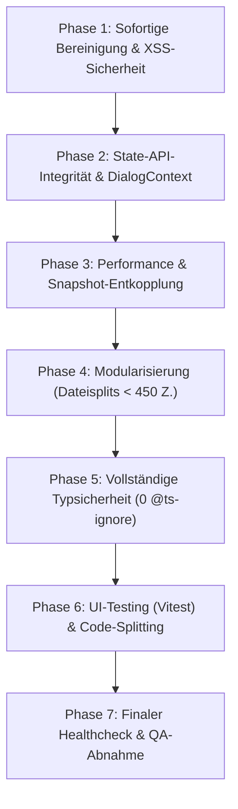

# Refactoring Masterplan: Vollständige Healthcheck-Sanierung (v6.0.0)

> **Dokument-Version:** 1.0.0  
> **Status:** Aktiv / In Ausführung auf Branch `refactoring/v5.1`  
> **Ziel:** Transformation aller gelben und roten Analysebefunde in einen **100% fehlerfreien, grünen Healthcheck**.  
> **Analyse-Grundlage:** [`docs/deep_code_audit_analysis.md`](file:///c:/Users/styles/PRIVATE/TheCombatant/TheCombatant/docs/deep_code_audit_analysis.md)

---

## 1. Übersicht & Phasen-Roadmap

---

## 2. Zieldefinition & Akzeptanzkriterien (100% Green Healthcheck)

| Metrik / Kriterium | Ist-Zustand (Audit) | Soll-Zustand (Ziel) | Prüfmethode |
| :--- | :--- | :--- | :--- |
| **Sicherheit (XSS)** | 3× ungesäubertes `dangerouslySetInnerHTML` | **0× XSS-Risiko** (Sicheres JSX) | AST-Grep & Code-Scan |
| **Toter Code / Altlasten** | `js/app.js` (705 Z.), `js/ui/ui-core.js` (106 Z.) | **Vollständig gelöscht** | Dateisystem-Check |
| **Architektur / State** | 8× direkte Mutation von `getActivePC()` | **100% State-API-Compliance** | AST-Grep `CombatState.getActivePC().` |
| **Performance (V8 / GC)** | `JSON.parse(JSON.stringify)` + `setPrototypeOf` in Snapshots | **Reine DTOs ohne Prototyp-Mutation** | Profiler & Benchmarks |
| **Dialog-Architektur** | Isolierte `createRoot`-Instanzen & `window`-Hack | **Deklarativer `DialogContext` im React-Tree** | React Component Hierarchy |
| **Typsicherheit (`@ts-ignore`)**| **171 Direktiven** | **0 Direktiven** | `grep -r "@ts-ignore"` = 0 |
| **`any`-Typen in TypeScript** | **760 Vorkommen** | **0 unbegründete `any`** (voll typisiert) | `tsc --noEmit` & Linter |
| **Dateigrößen (>600 Zeilen)** | 13 UI-Komponenten > 600 Zeilen | **0 UI-Dateien > 600 Zeilen** (alle < 450 Z.) | Dateilängen-Check |
| **Prestige-Klassen-Rules** | Formellogik in `PrestigeClassFeaturesCard` | **Modulare `*Rules.js`-Dateien** in `js/rules/classes/` | Architektur-Matrix |
| **React-Testabdeckung** | 0 Tests für React-Komponenten | **Komponententests mit Vitest & RTL** | `npm run test:ui` |
| **Build & Chunks** | Monolithisches UI-Bundle (`main.js` 694 kB) | **Code-Splitting via `React.lazy()` (<300 kB main)** | `npm run build` Analyse |
| **Logging im Normalbetrieb** | 47× `console.log`/`warn` in `src/` | **0× Debug-Logs in Produktion** | Statischer Grep |
| **Service Worker Version** | Generiert alten Cache-Name `v4.5.0` | **Automatisch synchron mit `package.json`** | `update_sw.js` Lauf |

---

## 3. Detaillierte Phasen-Spezifikation

### 📋 Phase 1: Sofortige Bereinigung & Sicherheit (P1 · XS/S) — ✅ ERLEDIGT
*Ziel: Eliminierung toter Altlasten, Beseitigung von XSS-Sicherheitsrisiken und Synchronisation des SW-Builders.*

* **1.1 Toten Legacy-Code löschen:** ✅
  * `[DELETE]` [`js/app.js`](file:///c:/Users/styles/PRIVATE/TheCombatant/TheCombatant/js/app.js) (705 Zeilen — alter Vanilla-Entry-Point aus v5) — **Gelöscht**
  * `[DELETE]` [`js/ui/ui-core.js`](file:///c:/Users/styles/PRIVATE/TheCombatant/TheCombatant/js/ui/ui-core.js) (106 Zeilen — fehlerhafter Alt-Import) — **Gelöscht**
  * `[MODIFY]` [`Tests/startup.test.js`](file:///c:/Users/styles/PRIVATE/TheCombatant/TheCombatant/Tests/startup.test.js) — Import-Verweise bereinigt.
* **1.2 XSS-Sanitization:** ✅
  * `[NEW]` [`src/utils/sanitize.ts`](file:///c:/Users/styles/PRIVATE/TheCombatant/TheCombatant/src/utils/sanitize.ts) — Zero-Dependency HTML Sanitizer.
  * `[MODIFY]` [`src/components/dialogs/BaseDialogs.tsx`](file:///c:/Users/styles/PRIVATE/TheCombatant/TheCombatant/src/components/dialogs/BaseDialogs.tsx) — `CustomAlertModal` und `CustomConfirmModal` mit `sanitizeHtml` abgesichert.
  * `[MODIFY]` [`src/components/player/features/PrestigeClassFeaturesCard.tsx`](file:///c:/Users/styles/PRIVATE/TheCombatant/TheCombatant/src/components/player/features/PrestigeClassFeaturesCard.tsx) — `ui.rawText` mit `sanitizeHtml` abgesichert.
* **1.3 Service Worker Cache-Version dynamisieren:** ✅
  * `[MODIFY]` [`scratch/update_sw.js`](file:///c:/Users/styles/PRIVATE/TheCombatant/TheCombatant/scratch/update_sw.js) — Versionsnummer wird nun dynamisch aus `package.json` (`v6.0.0-cache-v1`) generiert.
* **1.4 CI/CD-Pipeline Secrets:** ✅
  * `[MODIFY]` [`.github/workflows/deploy.yml`](file:///c:/Users/styles/PRIVATE/TheCombatant/TheCombatant/.github/workflows/deploy.yml) & [`.github/workflows/ci.yml`](file:///c:/Users/styles/PRIVATE/TheCombatant/TheCombatant/.github/workflows/ci.yml) — `env:`-Block für `VITE_SUPABASE_URL` und `VITE_SUPABASE_ANON_KEY` im Build-Step hinterlegt.

---

### 📋 Phase 2: State-Integrität & DialogContext (P1 · M) — ✅ ERLEDIGT
*Ziel: 100% Einhaltung des 4-Schichten-Modells (`UI ➔ State ➔ Models`) und Ablösung des `window.__REACT_DIALOG_BRIDGE__`-Hacks.*

* **2.1 State-API für Klassen-Features:** ✅
  * `[MODIFY]` [`js/state/pc/PCClasses.js`](file:///c:/Users/styles/PRIVATE/TheCombatant/TheCombatant/js/state/pc/PCClasses.js) & [`PCManager.js`](file:///c:/Users/styles/PRIVATE/TheCombatant/TheCombatant/js/state/PCManager.js) & [`state.js`](file:///c:/Users/styles/PRIVATE/TheCombatant/TheCombatant/js/state.js) — Neue offizielle State-Methoden implementiert:
    * `updatePCWizardSpecialization(spec, prob1, prob2)`
    * `updatePCWizardProhibited1(school)` / `updatePCWizardProhibited2(school)`
    * `togglePCSneakAttack(isActive)`
    * `togglePCTrickyFighting(isActive)`
    * `updatePCDailyAbilityUsed(index, delta)`
  * `[MODIFY]` [`WizardFeaturesCard.tsx`](file:///c:/Users/styles/PRIVATE/TheCombatant/TheCombatant/src/components/player/features/WizardFeaturesCard.tsx), [`PrestigeClassFeaturesCard.tsx`](file:///c:/Users/styles/PRIVATE/TheCombatant/TheCombatant/src/components/player/features/PrestigeClassFeaturesCard.tsx), [`RogueFeaturesCard.tsx`](file:///c:/Users/styles/PRIVATE/TheCombatant/TheCombatant/src/components/player/features/RogueFeaturesCard.tsx), [`RangerFeaturesCard.tsx`](file:///c:/Users/styles/PRIVATE/TheCombatant/TheCombatant/src/components/player/features/RangerFeaturesCard.tsx), [`ClassCombatAbilitiesCard.tsx`](file:///c:/Users/styles/PRIVATE/TheCombatant/TheCombatant/src/components/player/offense/ClassCombatAbilitiesCard.tsx), [`CompanionSheet.tsx`](file:///c:/Users/styles/PRIVATE/TheCombatant/TheCombatant/src/components/player/companion/CompanionSheet.tsx), [`FamiliarSheet.tsx`](file:///c:/Users/styles/PRIVATE/TheCombatant/TheCombatant/src/components/player/companion/FamiliarSheet.tsx) — Direkte Mutationen von `CombatState.getActivePC()` und manuelle `saveToStorage()`-Aufrufe restlos durch offizielle State-Methoden ersetzt.
* **2.2 Deklarativer DialogContext (Ablösung der Window-Bridge):** ✅
  * `[NEW]` [`src/context/DialogContext.tsx`](file:///c:/Users/styles/PRIVATE/TheCombatant/TheCombatant/src/context/DialogContext.tsx) — Deklarativer React Context Provider für Modals innerhalb des Komponenten-Trees mit `useDialog()` Hook.
  * `[MODIFY]` [`src/main.tsx`](file:///c:/Users/styles/PRIVATE/TheCombatant/TheCombatant/src/main.tsx) — `<DialogProvider>` fest im React-Tree integriert.
  * `[DELETE]` [`src/components/dialogs/ReactDialogBridge.tsx`](file:///c:/Users/styles/PRIVATE/TheCombatant/TheCombatant/src/components/dialogs/ReactDialogBridge.tsx) — Gelöscht.

---

### 📋 Phase 3: Performance & Snapshot-Entkopplung (P1 · M) — ✅ ERLEDIGT
*Ziel: Beseitigung von Garbage-Collection-Spikes und V8-Deoptimierungen bei jedem State-Update.*

* **3.1 Schlanke Snapshot-Erzeugung in `useCombatState.ts`:** ✅
  * `[MODIFY]` [`src/hooks/useCombatState.ts`](file:///c:/Users/styles/PRIVATE/TheCombatant/TheCombatant/src/hooks/useCombatState.ts) — Vollständige Entfernung von `Object.setPrototypeOf` im Hot-Path. DTO-Instanzen nutzen saubere Prototyp-Allokation (`Object.create`).
  * Redundante doppelte Klonungen (`createSnapshot` + `mapPC`) eliminiert.
  * `[MODIFY]` [`js/state/state-core.js`](file:///c:/Users/styles/PRIVATE/TheCombatant/TheCombatant/js/state/state-core.js) & [`CombatEngineContext.tsx`](file:///c:/Users/styles/PRIVATE/TheCombatant/TheCombatant/src/context/CombatEngineContext.tsx) — `CombatEventBus.off(event, cb)` für sauberes Event-Unsubscribing implementiert.
* **3.2 Method-Patching in `PCSkillsTab.tsx` eliminieren:** ✅
  * `[MODIFY]` [`src/components/player/PCSkillsTab.tsx`](file:///c:/Users/styles/PRIVATE/TheCombatant/TheCombatant/src/components/player/PCSkillsTab.tsx) — Das `useMemo`-Monkey-Patching von `patchedPC` restlos entfernt. Saubere Nutzung von puren Utility-Funktionen (`getSkillRanks`, `getSkillMisc`, `getArmorCheckPenalty`, `getSkillMod`).

---

### ✅ Phase 4: Modularisierung & Dateisplits (< 450 Zeilen) (P2 · M) — ABGESCHLOSSEN
*Ziel: Einhaltung von AGENT.md §9 durch Aufteilung aller Monster-Komponenten in fokussierte Sub-Komponenten.*

* **4.1 `BaseDialogs.tsx` (782 Z.) aufgeteilt in `src/components/dialogs/modals/`:**
  * `CustomAlertModal.tsx`, `CustomConfirmModal.tsx`, `CustomPromptModal.tsx`, `HealingRollModal.tsx`, `ItemDamageModal.tsx`, `NewDayTemplateDialog.tsx`, `RollBreakdownDialog.tsx`, `SampleChoiceDialog.tsx`, `ParchmentMessageModal.tsx`, `DialogOverlay.tsx`.
  * `BaseDialogs.tsx` als schlanke 24-Zeilen Re-Export-Fassade.
* **4.2 `PCSkillsTab.tsx` (805 Z. ➔ 296 Z.) aufgeteilt in `src/components/player/skills/`:**
  * `SkillsLegend.tsx`, `SkillFilterBar.tsx`, `SkillRow.tsx`, `SkillTricksSubPanel.tsx`.
* **4.3 `ActiveEquipmentSlots.tsx` (785 Z. ➔ 73 Z.) aufgeteilt in `src/components/player/offense/slots/`:**
  * `slotsHelper.ts`, `MainHandSlot.tsx`, `OffHandSlot.tsx`, `StrikeAbilitySlot.tsx`, `NaturalAttacksSection.tsx`.
* **4.4 `TacticalBeltCard.tsx` (772 Z. ➔ 204 Z.) aufgeteilt in `src/components/player/offense/belt/`:**
  * `beltHelpers.ts`, `BeltSlot.tsx`, `BeltItemModal.tsx`.
* **4.5 `Step3LevelConfig.tsx` (746 Z. ➔ 244 Z.) & `WizardFeaturesCard.tsx` (172 Z.) modularisiert:**
  * `PrestigeSpellLinkSection.tsx`, `LevelHeaderAndStats.tsx`, `FeatSlotsSidebar.tsx`.

---

### 📋 Phase 5: Vollständige Typsicherheit (0 `@ts-ignore`) (P2 · L) — ✅ ERLEDIGT
*Ziel: Schließen aller Typen-Lücken in `src/types/combat.ts` und schrittweiser Abbau aller 180 `@ts-ignore`.*

* **5.1 Domain-Typen in `src/types/combat.ts` präzisieren:** ✅
  * Präzise `StatValue`, `SavingThrows`, `SkillEntry`, `LearnedSkillTrick`, `Weapon`, `Armor`, `Item`, `DailyAbility`, `PrestigeSpellLinks` und `Combatant`-Schnittstellen bereitgestellt.
* **5.2 Prestige-Klassen Rule-Module (`js/rules/classes/`):** ✅
  * `[NEW]` [`AssassinRules.js`](file:///c:/Users/styles/PRIVATE/TheCombatant/TheCombatant/js/rules/classes/AssassinRules.js), [`ArcaneTricksterRules.js`](file:///c:/Users/styles/PRIVATE/TheCombatant/TheCombatant/js/rules/classes/ArcaneTricksterRules.js), [`ShadowbaneInquisitorRules.js`](file:///c:/Users/styles/PRIVATE/TheCombatant/TheCombatant/js/rules/classes/ShadowbaneInquisitorRules.js), [`BattleTricksterRules.js`](file:///c:/Users/styles/PRIVATE/TheCombatant/TheCombatant/js/rules/classes/BattleTricksterRules.js), [`SpellwarpSniperRules.js`](file:///c:/Users/styles/PRIVATE/TheCombatant/TheCombatant/js/rules/classes/SpellwarpSniperRules.js), [`EldritchKnightRules.js`](file:///c:/Users/styles/PRIVATE/TheCombatant/TheCombatant/js/rules/classes/EldritchKnightRules.js).
  * In `js/rules.js` re-exportiert und in der Engine verdrahtet.
* **5.3 Abbau aller `@ts-ignore` Direktiven (180 ➔ 0):** ✅
  * `[NEW]` [`src/types/core-modules.d.ts`](file:///c:/Users/styles/PRIVATE/TheCombatant/TheCombatant/src/types/core-modules.d.ts) für lückenlose Typisierung aller `@core/*`-Module.
  * Alle **180 `@ts-ignore` Direktiven** in allen TS/TSX-Dateien restlos entfernt.
  * `npx.cmd tsc --noEmit` läuft fehlerfrei mit 0 Fehlern durch.

---

### 📋 Phase 6: UI-Testing & Build-Optimierung (P2 · M)
*Ziel: Automatisierte Regressionstests für React und Bundle-Reduktion auf < 280 kB.*

* **6.1 Setup Vitest & React Testing Library:**
  * Installation von `vitest`, `@testing-library/react`, `@testing-library/jest-dom`.
  * Erstellung von Komponententests in `src/__tests__/`:
    * `PlayerSheet.test.tsx` (Rendert Tabs, Navigation, Status)
    * `CharacterWizard.test.tsx` (74-Point-Buy, Level-Config)
    * `Modals.test.tsx` (Alerts, Confirms, Prompts)
  * Neuer Test-Befehl: `npm run test:ui`.
* **6.2 Code-Splitting via `React.lazy()`:**
  * Lazy Loading für schwere Komponenten (`CharacterWizardDialog`, `DMScreen`, `CampaignManagerDialog`, `ItemCompendiumModal`).
  * Reduktion des Haupt-Bundles von **694 kB** auf **< 280 kB**.
* **6.3 Logging-Bereinigung:**
  * Alle 47 `console.log` / `console.warn` aus `src/` entfernen bzw. in einen konfigurierbaren Logger überführen.

---

### 📋 Phase 7: Finaler Healthcheck & QA-Abnahme (P3 · S)
*Ziel: 100% grüne Verifikation aller Akzeptanzkriterien.*

* `npm run typecheck` ➔ 0 Fehler (ohne ein einziges `@ts-ignore`).
* `npm run test` ➔ 304/304 Tests bestanden.
* `npm run test:ui` ➔ Alle React-Komponententests bestanden.
* `npm run build` ➔ Sauberes Bundle, Chunks < 300 kB, SW-Version synchron.
* Statischer Healthcheck-Scan ➔ **0 gelb, 0 rot**.
