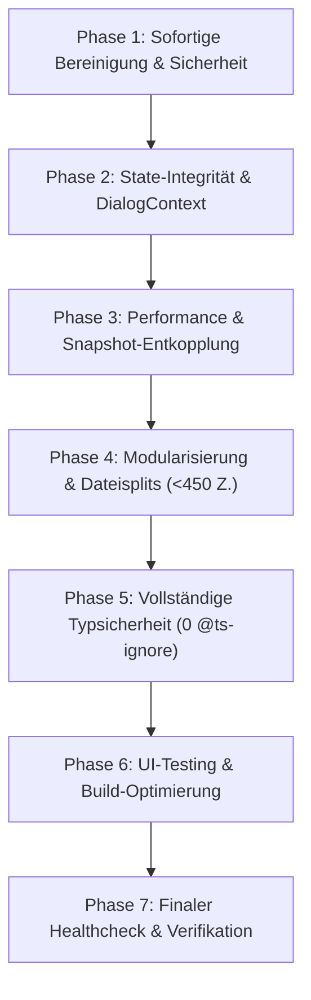

# Refactoring Masterplan: Vollständige Healthcheck-Sanierung (v6.0.0)

> **Dokument-Version:** 1.0.0  
> **Status:** Bereit zur schrittweisen Ausführung  
> **Ziel:** Transformation aller gelben und roten Analysebefunde in einen **100% fehlerfreien, grünen Healthcheck**.

---

## 1. Übersicht & Phasen-Roadmap

---

## 2. Phase 1 — Sofortige Bereinigung & Sicherheit (P1 · XS/S)

### 1.1 Toter Legacy-Code entfernen
- [DELETE] `js/app.js` (705 Zeilen alter Vanilla-App-Code)
- [DELETE] `js/ui/ui-core.js` (106 Zeilen — fehlerhafter Alt-Import)
- [MODIFY] `Tests/startup.test.js` — Import-Referenzen auf gelöschte Dateien anpassen.

### 1.2 XSS-Sanitization
- [MODIFY] `src/components/dialogs/BaseDialogs.tsx` — `CustomAlertModal` und `CustomConfirmModal` auf sicheres JSX umstellen.
- [MODIFY] `src/components/player/features/PrestigeClassFeaturesCard.tsx` — `dangerouslySetInnerHTML` absichern.

### 1.3 Service Worker Cache-Version dynamisieren
- [MODIFY] `scratch/update_sw.js` — Automatisches Auslesen der Versionsnummer aus `package.json` (`v6.0.0`).

---

## 3. Phase 2 — State-Integrität & DialogContext (P1 · M)

### 2.1 State-API-Erweiterung für Feature-Karten
- [MODIFY] `js/state/pc/PCClasses.js` & `PCGeneral.js` — Neue Aktionen:
  - `updatePCWizardSpecialization(spec, prob1, prob2)`
  - `togglePCSneakAttack(bool)`
  - `togglePCTrickyFighting(bool)`
  - `updatePCDailyAbilityUsed(index, delta)`
- [MODIFY] `src/components/player/features/WizardFeaturesCard.tsx`
- [MODIFY] `src/components/player/features/PrestigeClassFeaturesCard.tsx`
- [MODIFY] `src/components/player/features/RangerFeaturesCard.tsx`
- [MODIFY] `src/components/player/companion/CompanionSheet.tsx`
- [MODIFY] `src/components/player/companion/FamiliarSheet.tsx`

### 2.2 Deklarativer DialogContext
- [NEW] `src/context/DialogContext.tsx`
- [MODIFY] `src/main.tsx` — Einbindung des `DialogProvider` im React-Tree.
- [DELETE] `src/components/dialogs/ReactDialogBridge.tsx` & Beseitigung von `(window as any).__REACT_DIALOG_BRIDGE__`.

---

## 4. Phase 3 — Performance & Snapshot-Entkopplung (P1 · M)

### 3.1 Schlanke Snapshot-Erzeugung in `useCombatState.ts`
- [MODIFY] `src/hooks/useCombatState.ts` — Entfernung von `Object.setPrototypeOf` und Deep-JSON-Clones bei unveränderten Daten; Snapshots als reine Read-Only DTOs führen.

### 3.2 Method-Patching in `PCSkillsTab.tsx` eliminieren
- [MODIFY] `src/components/player/PCSkillsTab.tsx` — Verlagerung von `getSkillRanks`, `getSkillMisc`, `getArmorCheckPenalty` in Pure Helper Functions (`RulesSkills.js` / `attributeHelper.ts`).

---

## 5. Phase 4 — Modularisierung & Dateisplits (P2 · M)

Alle Dateien über 600 Zeilen werden in fokussierte Subkomponenten unter 400 Zeilen aufgeteilt:

1. **`BaseDialogs.tsx` (782 Z.) ➔ `src/components/dialogs/modals/`**
   - `CustomAlertModal.tsx` (~80 Z.)
   - `CustomConfirmModal.tsx` (~90 Z.)
   - `CustomPromptModal.tsx` (~80 Z.)
   - `HealingRollModal.tsx` (~110 Z.)
   - `ItemDamageModal.tsx` (~130 Z.)
   - `NewDayTemplateDialog.tsx` (~120 Z.)
   - `RollBreakdownDialog.tsx` (~140 Z.)
   - `SampleChoiceDialog.tsx` (~90 Z.)

2. **`PCSkillsTab.tsx` (816 Z.) ➔ `src/components/player/skills/`**
   - `PCSkillsTab.tsx` (~220 Z. — Orchestrierung & Filter)
   - `SkillRow.tsx` (~180 Z. — Skill-Zeile)
   - `SkillFilterBar.tsx` (~100 Z. — Suche & Toggle)
   - `SkillTricksSubPanel.tsx` (~200 Z. — Trick-Verwaltung)

3. **`ActiveEquipmentSlots.tsx` (785 Z.) ➔ `src/components/player/offense/slots/`**
   - `ActiveEquipmentSlots.tsx` (~200 Z.)
   - `WeaponSlotRenderer.tsx` (~220 Z.)
   - `ArmorSlotRenderer.tsx` (~180 Z.)
   - `NaturalAttacksRenderer.tsx` (~180 Z.)

4. **`TacticalBeltCard.tsx` (772 Z.) ➔ `src/components/player/offense/belt/`**
   - `TacticalBeltCard.tsx` (~180 Z.)
   - `PotionBeltSection.tsx` (~190 Z.)
   - `ScrollBeltSection.tsx` (~190 Z.)
   - `WandBeltSection.tsx` (~190 Z.)

5. **`CharacterWizardDialog.tsx` (794 Z.) & `Step3LevelConfig.tsx` (746 Z.)**
   - Modularisierung in Submodule (`WizardSummaryFooter.tsx`, `ClassLevelPicker.tsx`, `PrestigeRequirementCheck.tsx`).

---

## 6. Phase 5 — Vollständige Typsicherheit (0 `@ts-ignore`) (P2 · L)

### 5.1 Domain-Typen in `src/types/combat.ts` präzisieren
- Union-Types für alle dynamischen Stat-Felder (`acTouch`, `acFlat`, `za`, `ref`, `wil`, etc.).
- Komponenten-Props strikt typisieren (`{ pc: Combatant }`).

### 5.2 Prestige-Klassen Rule-Module
- [NEW] `js/rules/classes/AssassinRules.js`
- [NEW] `js/rules/classes/ArcaneTricksterRules.js`
- [NEW] `js/rules/classes/ShadowbaneInquisitorRules.js`
- [NEW] `js/rules/classes/BattleTricksterRules.js`
- [NEW] `js/rules/classes/SpellwarpSniperRules.js`
- [NEW] `js/rules/classes/EldritchKnightRules.js`

### 5.3 Systematischer Abbau aller 171 `@ts-ignore` Direktiven
- Bereinigung aller TSX-Komponenten bis `@ts-ignore` = 0.
- Vereinheitlichung auf `@core/`-Alias.

---

## 7. Phase 6 — UI-Testing & Build-Optimierung (P2 · M)

### 6.1 Vitest & React Testing Library
- Installation & Konfiguration von Vitest.
- Erstellung automatisierter UI-Tests für Dialoge, Wizard und PlayerSheet.
- Neuer Befehl: `npm run test:ui`.

### 6.2 Code-Splitting via `React.lazy()`
- Lazy Loading für `CharacterWizardDialog`, `DMScreen`, `CampaignManagerDialog` und `ItemCompendiumModal`.
- Reduktion des Haupt-Bundles von **694 kB** auf **< 280 kB**.

### 6.3 Logging-Bereinigung
- Bereinigung der 47 `console.log`-Statements aus `src/`.

---

## 8. Phase 7 — Finaler Healthcheck & Abnahme (P3 · S)

Verifikation der 100% grünen Healthcheck-Kriterien:
1. `npm run typecheck` ➔ 0 Fehler (ohne `@ts-ignore`).
2. `npm run test` ➔ 304/304 Tests bestanden.
3. `npm run test:ui` ➔ 100% UI-Tests bestanden.
4. `npm run build` ➔ Sauberes Bundle (< 300 kB Haupt-Chunk).
5. 0 Dateien > 600 Zeilen (ausgenommen statische Data-Registries).
