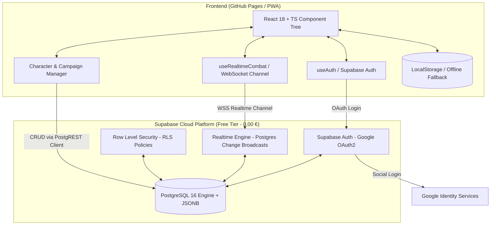

# 🚀 Masterplan Patch 6.0: Cloud-Sync, Multi-Session & Auth mit Supabase (0 € Stack)

> **Ziel:** Transformation der CombatApp zu einer vollwertigen Cloud-Webapplikation für Spielleiter und Spieler mit **0 € Hostingkosten**, **0 Server-Wartung** und maximaler Flexibilität über **Supabase (PostgreSQL + Auth + Realtime)** und **GitHub Pages**.

---

## 1. Rechtliches & Domain-Wegweiser (GitHub Pages + Custom Domain)

### A. Eigene Domain auf GitHub Pages: Geht das?
**Ja, absolut.** GitHub Pages unterstützt eigene Domains (z. B. `dnd-combat.de` oder `combatapp.app`) out-of-the-box:
- Man hinterlegt einfach eine `CNAME`-Datei im Repo oder stellt es in den GitHub Repository Settings ein.
- GitHub generiert und erneuert das **HTTPS-Zertifikat automatisch**.

### B. Impressum & DSGVO-Pflichten bei privaten Hobby-Tools:
| Hosting-Variante | Impressumspflicht (nach § 5 TMG / § 18 MStV) | Empfehlung |
|---|---|---|
| **Standard GitHub Pages URL** (`username.github.io/CombatApp`) | **Nein**, da rein private Nutzung im geschlossenen Freundeskreis ohne kommerzielle Absicht. | ⭐ **Einfachste & sicherste Option** |
| **Eigene Domain** (`meine-domain.de`) | **Grauzone:** Wenn die Seite öffentlich im Netz aufrufbar ist, verlangen deutsche Gerichte oft ein Impressum, es sei denn, die App ist komplett hinter einem Login/Zugangscode geschützt. | Wenn Domain: `.app` oder `.com` mit WHOIS-Privacy über Cloudflare (kostet ~10 €/Jahr) + Login-Gate. |

> [!TIP]
> **Empfehlung:** Starte mit der kostenlosen `github.io`-URL (oder Cloudflare Pages). Das spart dir Domain-Kosten, DNS-Konfiguration und sämtliche Impressums-/Abmahn-Themen komplett vom Hals.

---

## 2. Ziel-Architektur: Der schlanke 0-€-Stack



---

## 3. Warum Supabase der perfekte Fit für dieses Projekt ist

1. **0,00 € dauerhafte Kosten:** Der Free Tier bietet:
   - 500 MB PostgreSQL-Speicher (reicht für über 100.000 D&D-Charaktere).
   - 50.000 monatlich aktive Nutzer (bei deinen ~25 Spielern unerschöpflich).
   - Unbegrenzte API-Requests und 200 gleichzeitige Realtime-WebSockets.
2. **Echte PostgreSQL-Datenbank mit `JSONB`**:
   - Volle SQL-Power, Relationale Tabellen für Accounts & Kampagnen.
   - `JSONB` für den 1.500-Zeilen `Combatant`-Zustand (kein zeitraubendes Tabellen-Overengineering).
3. **Google Social Login Out-of-the-Box**:
   - Keine eigene Session-/Cookie-Crypto nötig; Supabase übernimmt JWT-Signing, Refresh-Tokens und Google-OAuth.
4. **Automatischer Realtime-Sync**:
   - Wenn der DM Monster-HP oder Initiativen ändert, streamt Supabase das Update über WebSockets direkt an alle Spieler-Handys/Tablets. **PeerJS kann ersatzlos gestrichen werden.**
5. **0% Server-Wartung (DevOps)**:
   - Keine Linux-Updates, kein Docker auf VMs, keine SSL-Zertifikatsfehler, keine Port-Freigaben.

---

## 4. Datenbankschema (Supabase PostgreSQL + RLS)

```sql
-- 1. PROFILES (Automatisch synchronisiert mit Supabase Auth)
create table public.profiles (
  id uuid references auth.users on delete cascade primary key,
  email text,
  name text,
  avatar_url text,
  created_at timestamp with time zone default timezone('utc'::text, now()) not null
);

-- 2. CHARACTERS (Charakter-Bibliothek der Spieler)
create table public.characters (
  id uuid default gen_random_uuid() primary key,
  user_id uuid references public.profiles(id) on delete cascade not null,
  name text not null,
  class_summary text,
  level integer default 1,
  character_data jsonb not null, -- Vollständiger Combatant State (PC-Objekt)
  is_active boolean default true,
  updated_at timestamp with time zone default timezone('utc'::text, now()) not null
);

-- 3. CAMPAIGNS (Multi-Session / Runden-Verwaltung für den Spielleiter)
create table public.campaigns (
  id uuid default gen_random_uuid() primary key,
  dm_user_id uuid references public.profiles(id) on delete cascade not null,
  name text not null,
  description text,
  invite_code text unique not null, -- z.B. "CRIT-7F"
  active_encounter_state jsonb default '{}'::jsonb, -- Runde, Turn, Monster-Array, InitBar
  is_active boolean default true,
  updated_at timestamp with time zone default timezone('utc'::text, now()) not null
);

-- 4. CAMPAIGN MEMBERS (Verknüpfung: Wer spielt in welcher Runde mit welchem Held?)
create table public.campaign_members (
  id uuid default gen_random_uuid() primary key,
  campaign_id uuid references public.campaigns(id) on delete cascade not null,
  user_id uuid references public.profiles(id) on delete cascade not null,
  character_id uuid references public.characters(id) on delete set null,
  role text default 'PLAYER' check (role in ('DM', 'PLAYER', 'SPECTATOR')),
  joined_at timestamp with time zone default timezone('utc'::text, now()) not null,
  unique(campaign_id, user_id)
);
```

---

## 5. Detaillierter, feingranularer Phasenplan (Zero-Regression)

Jeder Schritt ist so aufgebaut, dass bestehender Code nicht gefährdet wird und der Offline-/Gastmodus immer funktionsfähig bleibt.

---

### 📦 PHASE 1: Supabase-Projekt & SDK-Integration (✅ ABGESCHLOSSEN)
*Ziel: Supabase-Client im Projekt bereitstellen, ohne bestehende Logik zu verändern.*

- [x] **1.1 Supabase-Projekt erstellen (Benutzer-Aktion)**
  - Projekt `CombatApp` in Region `eu-central-1 (Frankfurt)` angelegt.
  - Project URL & Anon Public API Key in `.env.local` hinterlegt.
- [x] **1.2 Supabase SDK installieren**
  - `@supabase/supabase-js` erfolgreich via npm installiert.
- [x] **1.3 Typed Supabase Client anlegen (`src/services/supabase/`)**
  - `database.types.ts` und `supabaseClient.ts` mit Offline-Sicherheitskapselung implementiert.
  - *DoD erfüllt:* `npx tsc --noEmit` fehlerfrei (0 Fehler); 249/249 Unit-Tests unverändert grün.
- [x] **1.4 SQL-Schema & RLS-Policies in Supabase ausführen**
  - Tabellen `profiles`, `characters`, `campaigns`, `campaign_members` per SQL-Editor angelegt.
  - Trigger `on_auth_user_created` & Row Level Security (RLS) Policies erfolgreich scharf geschaltet.
  - *DoD erfüllt:* Tabellen & Indizes sind live in der Postgres-Instanz verfügbar.

---

### 🔐 PHASE 2: Authentifizierung & Google Social Login (✅ ABGESCHLOSSEN)
*Ziel: Login/Logout-System für Spieler und DM.*

- [x] **2.1 Google OAuth in Supabase aktivieren (Benutzer-Aktion)**
  - OAuth-Web-Client in Google Cloud Console angelegt (Origins: `http://localhost:5173`, `https://splattedrabbit.github.io`).
  - Google Provider in Supabase Dashboard mit Client-ID & Secret aktiviert.
- [x] **2.2 AuthContext & Hook erstellen (`src/context/AuthContext.tsx`)**
  - Zustand: `user`, `profile`, `session`, `isLoading`, `signInWithGoogle()`, `signOut()`.
  - Supabase Auth Listener (`supabase.auth.onAuthStateChange`) mit automatischem Profil-Sync.
- [x] **2.3 Header-Login-Integration (`UserMenu.tsx`, `PCHeader.tsx`, `DMHeader.tsx`, `RoleSelection.tsx`)**
  - D&D-Parchment Login-Button ("🎲 Mit Google anmelden") & Profil-Dropdown.
  - *DoD erfüllt:* Klick auf Login startet Google-OAuth2; nach Callback ist der Nutzer eingeloggt und sein Avatar/Name erscheint im Header.

---

### 🛡️ PHASE 3: Storage-Adapter-Pattern (Non-Breaking Fallback)
*Ziel: Die bestehende `StorageManager.js` flexibel machen, ohne Komponenten umzubauen.*

- [ ] **3.1 `IStorageAdapter`-Interface definieren (`src/services/storage/IStorageAdapter.ts`)**
  - Methoden: `saveActivePC(pc)`, `loadActivePC()`, `saveEncounter(state)`, `loadEncounter()`.
- [ ] **3.2 `LocalStorageAdapter.ts` implementieren**
  - Kapselt die bisherige `localStorage`-Logik 1:1.
  - Greift automatisch, wenn der Nutzer **nicht** eingeloggt ist (Gastmodus bleibt 100% funktionsfähig).
- [ ] **3.3 `SupabaseStorageAdapter.ts` implementieren**
  - Speichert bei eingeloggtem Nutzer debounced (800ms) in die `characters`- bzw. `campaigns`-Tabelle.
- [ ] **3.4 `StorageManager.js` umstellen**
  - Delegiert transparent an den aktiven Adapter je nach `AuthContext.isAuthenticated`.
  - *DoD:* Sämtliche 249 Unit-Tests laufen grün; Speichern funktioniert sowohl offline als auch in Supabase.

---

### 👤 PHASE 4: Charakter-Bibliothek (Multi-Character für Spieler)
*Ziel: Spieler können mehrere Charaktere in ihrem Account verwalten.*

- [ ] **4.1 Character Roster Dialog (`src/components/player/CharacterRosterDialog.tsx`)**
  - Modal mit Übersicht aller Charaktere des Spielers (Name, Klasse, Level, letztes Update).
  - Aktionen:
    - ➕ *Neuer Charakter* (startet leeren Bogen oder Wizard).
    - ⚡ *Charakter laden* (lädt Charakter in den Bogen).
    - 📑 *Duplizieren* / 🗑️ *Löschen*.
    - 📥 *Aus LocalStorage importieren* (1-Klick-Übernahme des alten Charakters).
- [ ] **4.2 Automatisches Auto-Sync**
  - Änderungen am Bogen (z. B. HP, Items, Spells) werden im Hintergrund zu Supabase synchronisiert.
  - *DoD:* Spieler legt Charakter 1 an, wechselt zu Charakter 2, wechselt zurück $\rightarrow$ alle Werte sind exakt erhalten.

---

### 🎲 PHASE 5: DM Multi-Campaign & Session Dashboard
*Ziel: Der Spielleiter kann beliebig viele Runden verwalten und wechseln.*

- [ ] **5.1 Campaign Manager Dialog (`src/components/dm/CampaignManagerDialog.tsx`)**
  - Liste aller Kampagnen des DMs (z. B. *"Mittwochsrunde: Eberron"*, *"Ravenloft"*).
  - ➕ *Neue Kampagne anlegen* (Name, Notizen, automatischer Raumcode wie `RAVEN-42`).
- [ ] **5.2 Kampagnen-Wechsler**
  - DM wählt die aktive Kampagne aus $\rightarrow$ der zugehörige Encounter-State (Monster, Initiative-Reihenfolge, Runden-Timer) wird geladen.
- [ ] **5.3 Spieler-Einladungen**
  - DM kopiert Einladungslink oder 6-stelligen Code.
  - Spieler tritt Kampagne bei und wählt seinen Helden aus der eigenen Bibliothek.
  - *DoD:* DM wechselt zwischen Kampagne A und B; beide behalten ihren separaten Kampfzustand.

---

### ⚡ PHASE 6: Realtime WebSocket-Sync (Ablösung von PeerJS)
*Ziel: Zuverlässige Echtzeit-Synchronisation am Spieltisch ohne NAT-/Broker-Probleme.*

- [ ] **6.1 Supabase Realtime Channel (`src/services/network/SupabaseRealtime.ts`)**
  - Raum-Abonnement: `supabase.channel('campaign:' + campaignId)`
  - Broadcast-Events für:
    - Initiative-Sortierung / Runden-Wechsel
    - Monster- & Spieler-HP-Änderungen
    - Live Würfelwürfe & Buff-Aktivierungen
- [ ] **6.2 PeerJS aus dem Projekt entfernen**
  - `NetworkManager.js` durch `SupabaseRealtime.ts` ersetzen.
  - Entfernen von `js/peerjs.min.js` aus `vite.config.ts` und Build-Kopien.
  - *DoD:* Multi-Device-Test (z.B. PC + Smartphone): DM ändert HP $\rightarrow$ Smartphone-Bildschirm aktualisiert sich in < 30ms.

---

### 🧪 PHASE 7: QA-Automation & Test-Suite
*Ziel: Stabile Absicherung deines neuen Cloud-Stacks mit automatisierten Tests.*

- [ ] **7.1 Integrationstests für Supabase-Adapter**
  - Testen von CRUD-Operationen und Fehlerbehandlung bei Offline-Zustand.
- [ ] **7.2 Playwright E2E-Tests (Multi-Role-Szenario)**
  - Test-Skript mit 2 parallelen Browser-Kontexten:
    - Kontext 1: Spielleiter startet Encounter.
    - Kontext 2: Spieler tritt bei $\rightarrow$ Initiative synchronisiert sich.
  - *DoD:* E2E-Tests laufen vollautomatisiert lokal oder in GitHub Actions durch.

---

## 6. Zusammenfassung der Vorteile für dich

| Aspekt | Bisher (v5.0) | Neu mit Supabase (v6.0) |
|---|---|---|
| **Hostingkosten** | 0,00 € | **0,00 €** |
| **Server-Wartung** | Keine | **Keine** (Managed Postgres) |
| **Multi-Campaigns für DM** | ❌ (nur 1 State) | ✅ **Unbegrenzte Kampagnen** |
| **Multi-Characters für Spieler** | ❌ (nur 1 PC) | ✅ **Account-weite Bibliothek** |
| **Echtzeit-Synchronisation** | ⚠️ Störanfällig (PeerJS P2P) | ✅ **Supabase WebSockets (Enterprise-Grade)** |
| **Geräte-Flexibilität** | Nur lokaler Rechner | ✅ **PC, Tablet & Smartphone synchron** |
| **Rechtliches / Impressum** | Keine Pflichten | **Keine Pflichten** (privates Tool auf GitHub Pages) |
